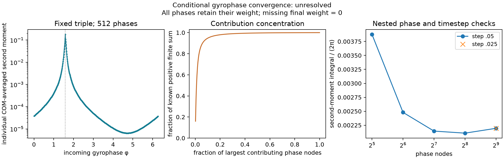

# What can magnetic-moment-preserving collisions relax?

A JAX research prototype based on [Sato & Morrison (2025)](https://doi.org/10.1063/5.0289410). It tests how conservation laws, magnetic geometry and interaction range determine **which parts of a particle distribution can change**.

[Run it](#run-the-experiments) · [Examples](examples/README.md) · [Full derivations](notes/implementation.pdf) · [Validation ledger](results/validation.csv)

## From particle orbits to a distribution

A charged particle spirals around a magnetic field. When that orbit is much smaller and faster than the variations we study, we can average over the spiral's phase and track its **guiding center**. Instead of following every particle, we evolve **f**, a distribution of centers with different positions, parallel velocities and magnetic moments.


Here **m** is particle mass and **B** is field strength. The magnetic moment **μ** measures perpendicular orbit energy divided by B; it is not a temperature. In a slowly varying field it is approximately conserved by ideal particle motion. **The constrained collision model studied here preserves it exactly by construction.** Whether real encounters justify that constraint is a separate physical question.

## The equation separates motion from collisions

![The kinetic equation: time derivative of f plus guiding-center transport equals C[f]. The phase-space measure is B dX du dmu.](results/first_principles/kinetic_equation.svg)

The left side transports particles through the prescribed field. **C[f]** is the chosen collision operator: it describes how interactions redistribute the population. Most nonuniform examples isolate collisions; the toroidal example also includes compatible ideal motion. The factor **B** in the volume element tells us how to count particles in these coordinates.

The operator preserves particle number, total energy and the complete magnetic-moment distribution. It also makes entropy—a measure of how the population is spread through phase space—nondecreasing. These properties still do **not** guarantee complete mixing or a unique final state.

## Preserving a whole distribution is stronger than preserving its mean

Imagine sorting particles into bins according to μ. **G(μ)** counts each bin after summing over position and parallel velocity. With closed boundaries, the constrained model keeps every bin's population fixed.


The bars are an illustration, not a simulation. Position and parallel velocity may change while G stays fixed—but additional properties of the operator can forbid some of those changes too. We test those restrictions rather than assuming them away.

## An exact example: one part freezes, another decays

Start with a uniform magnetic field and a spatially uniform reference distribution **f₀**, then add a small perturbation **δf**. Split that perturbation into two pieces:

- **A density pattern:** all velocities receive the same fractional modulation, f₀ δn/n₀.
- **A change of shape:** the remainder **g**, whose velocity integral is zero, redistributes population without changing local density.

Here n₀ and δn are the velocity integrals of f₀ and δf with measure B du dμ. With constant electric potential and collision-only evolution, the local linear model from Eq. (181) gives:


**q** is particle charge, **k⊥** is the perpendicular spatial wavenumber, and **D** is a prescribed model coefficient. A sinusoidal shape change decays exponentially; its common density pattern survives. Spatially homogeneous perturbations are also undamped by this particular local model. This differs from ordinary homogeneous Landau thermalization.


The curves come from independently assembled operators, checked against the exact solution. With a Gaussian interaction range, particles at separated positions can interact and the density pattern also decays. For the illustrated range, its rate is **0.165 λ**, while the shape-change rate remains **λ**. The time axis is normalized model time, not a calibrated physical clock.

<details>
<summary>Watch the same local and finite-range operators evolve</summary>


Each row is an illustrative velocity-quadrature node, not a resolved physical 3V velocity grid. Both panels start identically and use the same colors. [MP4](results/visual_summary/range_evolution.mp4) · [Saved evolution](results/visual_summary/metadata.json) · [Script](examples/09_visual_summary.py)

</details>

## A dipole can remember where its particles started

In the local dipole model, magnetic **flux surfaces**—surfaces containing field lines—supply another population constraint. The collision-only dynamics preserve the full distribution of particles over these surfaces. Conserving only the *mean* flux misses this memory.


The construction above matches number, energy, G(μ) and mean flux, yet the two populations cannot both reach the same proposed stationary distribution. Relative entropy measures their difference from that candidate: it is zero only when the distributions coincide. Here it stays above **1.5141e−5 per particle**. Joint quadrature refinement changes that bound by **1.1e−10** relatively. This is a checked obstruction for the specified local model; it is not a physical dipole lifetime or a claim of publication priority. [Construction and inputs](examples/15_dipole_obstruction.py) · [Evidence](results/dipole_obstruction/summary.json)

<details>
<summary>Two more checks: angular boundaries and numerical null modes</summary>


Local conservation can depend on the domain: this mixed position–velocity moment is valid on an angular patch and cannot extend periodically. [Script](examples/20_local_mixed_null.py) · [Independent audit](results/local_mixed_null/independent_audit.json)


A **null mode** is a change the operator leaves untouched. Some sampled nulls arise from the grid: three extra axisymmetric polynomial modes cancel at the nodes but vary between them. Four-node quadrature detects what three nodes miss. We retain these modes and explain them; removing them would manufacture decay. [Script](examples/21_collocation_nullspace.py) · [Raw spectra and thresholds](results/collocation_nullspace/summary.json)

</details>

## Do real encounters preserve magnetic moment?

Real encounters can exchange parallel and perpendicular energy, changing μ. To test the model's exact constraint, we integrate two repelling particles in a uniform field. We fix the separation of their spiral centers and their incoming relative speeds, then vary the **incoming phase**, the angle around the spiral as they approach.


The incoming speeds and orbit-center separation are identical; only the phase changes. One encounter passes through in **25.35** normalized time units, while the other reflects after **90.35**. Their final magnetic moments are **1.020** and **1.912** times their initial values. Each line stops at its exit. These are two individual paths with a stationary center of mass, outside a verified adiabatic/grazing regime. They demonstrate why exact μ conservation needs a physical justification. [MP4](results/encounter_movie/encounter.mp4) · [Static figure](results/encounter_movie/poster.svg) · [Inputs and checks](results/encounter_movie/summary.json)

<details>
<summary>Do two accurate trajectories determine the average collision effect?</summary>



The left panel measures squared change in μ, averaged over motion of the pair's center of mass (COM). A few phases dominate the sampled average. Halving the integration timestep changes the 512-phase average by only **3.13×10⁻¹¹**, but doubling the phase count still changes it by **3.94%**. Agreement at sampled angles does not resolve the angles between them. This conditional study remains **unresolved**. [Inputs and controls](results/encounter_phase/summary.json) · [Script](examples/24_encounter_phase.py)

</details>

<details>
<summary>Why can a finite phase grid miss slow encounters?</summary>

Some incoming phases pass through; others reflect. If two exact trajectories have opposite exits before a fixed time, continuity implies an interval of intermediate angles that have not yet exited. A finite phase grid can miss that interval. This is a conditional mathematical statement; the computed trajectories are not certified exact solutions.


The finer search remains unresolved. Its right panel compares trajectories from smaller integration steps and separate individual-particle equations. Their energy errors are near **10⁻¹²**, yet their final positions disagree by tens to hundreds of normalized length units; one predicted reflection becomes transmission. **Energy conservation alone is not an accuracy test.** Neither these disagreements nor a timeout proves chaotic motion or trapping. [Derivation and antecedents](notes/implementation.pdf) · [All six failed trajectory checks](results/encounter_censoring/precision_checked/summary.json)

</details>

## What has actually been checked?

| Question | Evidence |
|---|---|
| Does the uniform implementation reproduce Eq. (181)? | Independent pair calculation agrees to **2.36e−16** |
| Does toroidal decay survive refinement? | Eight final refinement changes below **0.71%**; all **39** finite-grid collision nulls explained |
| Does nonlinear mirror relaxation survive refinement? | **15 runs**, eight checks; largest final change **0.197%**; coarse timesteps still have **2–3% bias** |
| Are difficult-field solves reproducible? | Both three-field pilots completed; two preconditioners agree within **1.50e−12** in the weighted log norm; full refinement remains open |
| Is the encounter table accurate everywhere? | **No.** Fresh 4,096-state p95 error **2.54%**, but **8 states exceed 100%** relative error |
| Do the regression tests pass? | **247 passed** locally and on fresh Linux CI, including underflow failure handling |

[Reproduction record](results/deep_reproduction.json) · [Mirror refinements](results/nonuniform_entropy/mirror_audit.json) · [Independent solver audit](results/solver_accuracy/audit.json) · [Scattering validation](results/scattering_table/refined8_validation4096/audit.json) · [Completed pilot comparison](results/nonuniform_spatial_blocks/preconditioner_comparison.json) · [Full refinement attempt](https://github.com/rogeriojorge/sato-morrison/actions/runs/37803682825)

## Run the experiments

```sh
git clone https://github.com/rogeriojorge/sato-morrison.git
cd sato-morrison
python3.12 -m venv .venv
source .venv/bin/activate
python -m pip install -e '.[dev]'
python -m pytest -q
MPLBACKEND=Agg python examples/00_uniform_reference.py
MPLBACKEND=Agg python examples/01_relaxation.py
MPLBACKEND=Agg python examples/22_first_principles.py
```

The [editable examples](examples/README.md) expose inputs at the top, print progress and reject failed solves. Results record inputs, units, source commit, versions and hardware. The [figure-generation record](results/first_principles/summary.json) distinguishes illustrations from measured evolution. SOLVAX supplies linear algebra; no other UW Plasma physics code is required.

## Prototype, numerical verification, physical validation

The nonlinear local kernel and finite-range kernel are **specified surrogate models** extending the source's simplified linear setting. They are not an evaluation of the full source Eq. (119). Lorentz, Dougherty, physical 3V Landau weak moments and direct magnetized encounters provide separate controls.

Remaining work includes dipole/nonaxisymmetric refinement, complete-trajectory cost comparisons, wider encounter coverage, and physical calibration. Several full-campaign dipole cases fail visibly in extreme tails; their accepted partial states and diagnostics are retained. Confined dipole dynamics also need compatible ideal boundaries. No physical collision rate, spectral gap or metastable lifetime is claimed.

At matched error on an Apple M4, the small implicit benchmark takes **43.8 μs** with diagonal-PCG versus **550 μs** dense, using **16.8 kB** versus **263 kB** of temporary buffers. These synchronized warm measurements do not establish a general nonuniform speedup. [Benchmark](results/benchmarks/summary.json)

<details>
<summary>What does a difficult dipole solve cost?</summary>

An implicit timestep repeatedly solves a linear system. A **preconditioner** supplies a cheaper approximation that helps the iterative solver reach the same answer. Here `xline` couples grid points along one direction; `xyz` uses all three spatial directions.


For one frozen dipole correction, median times were **210.1 s** and **51.7 s**, both below **10⁻⁷** relative correction error. Full spatial blocks used more temporary memory. The spread reflects a shared M4 under varying load; this is not a full-trajectory or general speedup result. [Inputs, all repeats and memory accounting](results/difficult_correction/summary.json) · [Script](examples/23_difficult_correction.py)

</details>


<details>
<summary>Why can a solver fail even when its linear solve passes?</summary>

The nonlinear solver uses the logarithm of density, **g = log f**, to preserve positivity. Extremely small populations can still exceed floating-point range: evaluating **f = exp g** may return zero.


In this recorded replay, the linear residual passes but all 30 trial updates fail before the objective is evaluated. Four exceed the log range; 26 lose positive population. The failed step is rejected visibly. A separate 300-second trial with 60 backtracks permits tiny updates but leaves the residual near **2.887**, far above **10⁻¹²**. No second timestep is accepted, and no density floor or relaxed conservation criterion is applied. [Recorded ray and diagnostics](results/nonuniform_spatial_blocks_full/dipole_dt16_replay/summary.json) · [Plot script](examples/26_tail_guard.py)

</details>

The [technical notes](notes/implementation.pdf), [LaTeX source](notes/implementation.tex) and [bibliography](notes/references.bib) contain full derivations, literature comparisons and limitations. Original code, notes, figures and data are [MIT](LICENSE); third-party papers remain outside the repository.
