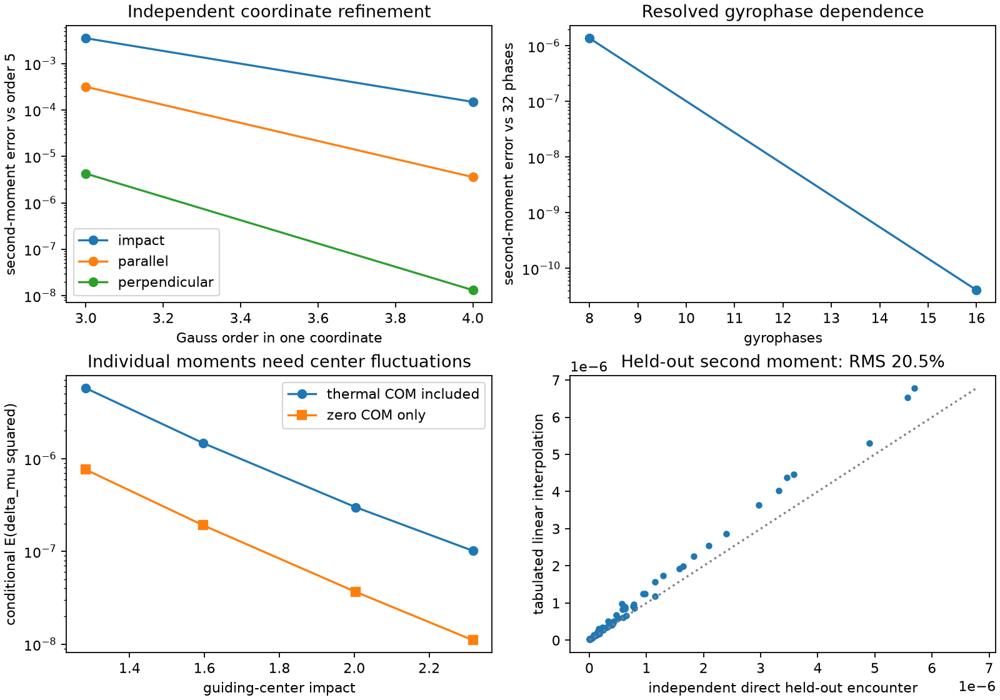

# Sato–Morrison collision prototypes

**What relaxes when collisions preserve the full magnetic-moment distribution?**

This small JAX research code reproduces the uniform-field limit of Sato–Morrison Eq. (181), tests nonlinear constrained surrogates, and checks their limits against independent collision and encounter calculations. Geometry leaves additional quantities frozen. Finite interaction range can remove some of those constraints.

[Derivations & literature](notes/implementation.pdf) · [Validation ledger](results/validation.csv) · [Recorded results](results/summary.csv) · [Reproduce](#reproduce)


**Same perturbation, different nullspaces.** Independently assembled linear operators evolve nine velocity nodes on a fixed color scale. Density structure survives local collisions; finite range damps it. Time uses the prescribed coefficient, without physical rate calibration. [Still image](results/visual_summary/range_poster.png) · [MP4](results/visual_summary/range_evolution.mp4) · [Script](examples/09_visual_summary.py) · [Inputs and checks](results/visual_summary/metadata.json)

## Start here

```sh
git clone https://github.com/rogeriojorge/sato-morrison.git
cd sato-morrison
python3.12 -m venv .venv
source .venv/bin/activate
python -m pip install -e '.[dev]'
python -m pytest -q
MPLBACKEND=Agg python examples/00_uniform_reference.py
MPLBACKEND=Agg python examples/01_relaxation.py
```

Examples are editable top-level scripts with explicit inputs, progress, diagnostics and saved plots. They enable float64, announce compilation, and raise on failed solves. SOLVAX supplies general linear algebra; there is no dependency on other UW Plasma physics codes.

## What the calculations establish

**66 tests pass.** The checks compare independent equations, discrete conservation budgets and resolved limits.


**A. Nonlinear relaxation.** Number, energy and full magnetic-moment-marginal errors stay below `1e-15`. Entropy increases; nodal and reconstructed positivity pass. Timestep order: `2.00`.

**B–C. Toroidal dynamics.** Combined streaming and collisions give `Q/Q₀ = 0.8109803`. Independent grid, tail and timestep refinements change the dissipated fraction by less than `0.71%`. Streaming alone preserves this norm.

**D. Null modes are retained.** Independently verified invariants account for all 39 near-zero eigenvalues of the raw 243-node matrix. Signed roundoff values are shown without clipping. This does not establish a continuum gap.

[Nonlinear data](results/relaxation.json) · [Toroidal data, refinements and eigenvalues](results/geometry.json) · [Figure script](examples/09_visual_summary.py)

## The model, and its exact uniform limit

For a prescribed vacuum field, the state and invariant measure are

```math
f=f(\mathbf X,u,\mu),\qquad
\mathrm d\Gamma=B\,\mathrm d^3X\,\mathrm du\,\mathrm d\mu,
\qquad E=\tfrac12mu^2+\mu B+q\Phi.
```

The implemented nonlinear weak surrogate is

```math
\begin{aligned}
\int\phi\,C[f]\,\mathrm d\Gamma
&=-\frac12\iint ff'\,\Delta\phi^{\mathsf T}\Pi\,\Delta\ln f\,
\mathrm d\Gamma\,\mathrm d\Gamma',\\
\Delta\phi&=J\nabla\phi-J'\nabla'\phi',\qquad \Pi=D\,P I_X P.
\end{aligned}
```

Pair vectors use the same Cartesian chart $(\mathbf X,u,\eta=\mu B)$. Local quadrature includes both velocity Jacobians. The energy projector uses the same discrete derivative as the weak form. Undefined nonuniform zero directions fail visibly.

This simplified kernel and its nonlinear extension are **not the full source Eq. (119)**. The implemented local scalar approximation to Eq. (181) has the independently checked uniform limit

```math
C_L[\delta f]=\frac{D}{(qB)^2}\nabla_\perp^2
\bigl(n_0\delta f-f_0\delta n\bigr),
\qquad \lambda=\frac{Dn_0 k_\perp^2}{(qB)^2}.
```

The 216-node pair calculation matches this oracle to relative error `2.36e-16`. Every homogeneous velocity perturbation and every local density-like mode is undamped. For a nonzero perpendicular Fourier mode, the remaining velocity-neutral modes decay at $\lambda$. [Oracle and timestep evidence](results/uniform_reference/summary.json)

## Two consequences worth investigating

### Finite range changes which density modes survive


For a normalized Gaussian spatial kernel of width $\ell$, independent ordered-pair assembly verifies

```math
\lambda_{\mathrm{neutral}}=\lambda,\qquad
\lambda_{\mathrm{density}}=\lambda\left(1-e^{-\ell^2|\mathbf k|^2/2}\right).
```

Finite range lifts the density null mode and gives quartic transverse long-wave decay; homogeneous modes remain undamped. The finest density-rate error across 27 comparisons is `3.03e-13`. The middle panel exposes large errors from unresolved narrow kernels.

This independently checked **surrogate result** has unresolved publication priority and no inferred physical rate. [All 27 comparisons](results/finite_range/summary.csv)

### Toroidal geometry obstructs unique relaxation

Local toroidal collisions preserve **every spatial population**. Streaming still preserves every radial population, obstructing a unique equilibrium determined by energy and the magnetic-moment marginal alone.

An independent smooth-nullspace audit gives

```math
\begin{aligned}
h_{\mathrm{collision}}&=\phi(R,\theta,z)+g(\theta,\mu)+a(\theta)E+b(\theta)mRu,\\
h_{\mathrm{joint}}&=\phi(R)+g(\mu)+aE+b\,mRu.
\end{aligned}
```

Here “joint” means collision-null and stationary under ideal streaming. The classification assumes $B=C/R>0$, constant potential, positive pair weight and an open product velocity support. Closed periodic/tangent boundaries are required for the stated evolution budgets. The [proof and scope](notes/implementation.pdf) are separate from the finite-grid rank check. No quantitative decay bound follows; publication priority remains unresolved.

## Geometry and physical scope

| Field | Implemented evolution and measure | Boundary treatment |
|---|---|---|
| Uniform | Nonlinear collisions; $B\,\mathrm d^3X\,\mathrm du\,\mathrm d\mu$ | Periodic spatial direction; natural zero collision flux in velocity |
| Vacuum toroidal | Linear collisions + Hamiltonian streaming; $RB\,\mathrm dR\,\mathrm d\theta\,\mathrm dz\,\mathrm du\,\mathrm d\mu$ | Periodic angle/height; tangent radial walls; zero collision flux |
| Harmonic mirror, dipole, controlled nonaxisymmetric | Nonlinear collision-only Cartesian boxes; $B\,\mathrm d^3X\,\mathrm du\,\mathrm d\mu$ | Natural zero collision flux; no combined confined dynamics claim |

The known stationary density family and a full-marginal equilibrium multiplier are checked independently. A stationary candidate is not a proof of attraction. [Density comparisons](results/equilibria/density.png)

**New velocity-tail check:** 36 nonuniform initial-production cases. All three fields pass the Gauss-quadrature target; the largest final change is `0.261%`. Trapezoidal controls remain unresolved at `10–17%`. This does not establish full time-evolution or joint spatial/velocity convergence. [Convergence plot](results/field_velocity/production.png) · [All checks](results/field_velocity/summary.json)



**Energy conservation does not imply magnetic-moment conservation.** Direct screened encounters resolve nonzero moment changes. The new incoming-flux ensemble includes thermal center-of-mass fluctuations and independently refines impact, velocity, phase and endpoints. Final direct-quadrature changes are below `0.021%`.

**A converged integral is not a validated interpolant.** The scattering table has `20.5%` held-out second-moment error against a `10%` target. It remains unresolved. The sampled speed band covers only `11.6%` of the incoming thermal flux in the chosen annulus, so the conditional coefficients are not full plasma rates.

| Independent control | Verified capability | Limit |
|---|---|---|
| Lorentz | Exact speed-shell Legendre decay | Momentum exchanges with a reservoir |
| Dougherty | Conserving nonlinear Gaussian-mixture evolution; independent strong-equation check | Homogeneous mixture family |
| Physical 3V Landau | Coulomb weak moments checked by spherical, Cartesian and independent Laplace quadratures | Not a general Landau time integrator |
| Magnetized encounters | Direct trajectories, bounded Maxwellian flux and analytic thermal-center moments | Held-out table unresolved; no calibrated constrained coefficient or lifetime |

[Control evidence](results/controls/metadata.json) · [Bounded-flux evidence](results/encounter_ensemble/metadata.json) · [Trajectory controls](results/encounters/metadata.json). The prototype stage is implemented and tested. A physically validated constrained kinetic closure remains open.

## Measured cost


Four spatial blocks × 128 velocity nodes, Apple M4 CPU, five synchronized repetitions; all routes have the same time-discretization error `2.77e-5`. Bars show warm medians; whiskers show min–max. Compilation plus first execution is `0.092 / 0.184 / 0.225 s` for dense / PCG / diagonal-PCG.

For the separate 945-pair weak action, chunking by 16 reduces XLA temporary buffers from 118,913 to 16,480 bytes, while warm median time grows from 96.3 to 158.2 μs. These are small CPU measurements, not a general nonuniform speedup claim. Process peak RSS is recorded separately from temporary buffers. [Complete matched-error measurements](results/benchmarks/summary.json)

## Reproduce

Run from the repository root with the environment above. Every script prints its inputs and writes data and figures under `results/`.

| Command (prefix with `MPLBACKEND=Agg python`) | Calculation |
|---|---|
| `examples/00_uniform_reference.py` | Eq. (181) oracle and backward-Euler convergence |
| `examples/01_relaxation.py` | Positive nonlinear solve, entropy and timestep refinement |
| `examples/02_geometry.py` | Toroidal controls, eight refinements and raw nullspace |
| `examples/03_controls.py` | Lorentz, Dougherty and physical 3V Landau references |
| `examples/04_encounters.py` | Direct encounters and phase/endpoint controls |
| `examples/05_benchmarks.py` | Matched-error runtime and memory |
| `examples/06_range.py` | Finite-range spectrum and kernel resolution |
| `examples/07_equilibria.py` | Five-field stationary density quadrature |
| `examples/08_fields.py` | Three nonlinear nonuniform collision boxes |
| `examples/09_visual_summary.py` | Operator animation and README panels; uses recorded results |
| `examples/10_encounter_ensemble.py` | Bounded incoming flux and held-out scattering table |
| `examples/11_field_velocity.py` | Nonuniform initial-production velocity/tail convergence |

MP4 export additionally uses `ffmpeg`; GIF export works with the listed Python dependencies.

Each result records inputs, units, source commit/digest, versions and hardware. Older experiments retain their original provenance when new ones are added. The [validation ledger](results/validation.csv) distinguishes passing, unresolved and unrun requirements; [original](results/reproduction.json) and [continuation](results/continuation.json) records contain executed commands. Detailed mathematics and literature belong in the [notes](notes/implementation.pdf), with [LaTeX source](notes/implementation.tex) and [bibliography](notes/references.bib).

<details>
<summary>Rebuild the notes</summary>

```sh
cd notes
pdflatex -interaction=nonstopmode -halt-on-error implementation.tex
bibtex implementation
pdflatex -interaction=nonstopmode -halt-on-error implementation.tex
pdflatex -interaction=nonstopmode -halt-on-error implementation.tex
```

</details>

## Remaining limits

The nonlinear solver uses a dense Newton Jacobian on tractable grids. Full nonuniform time-evolution and joint spatial/velocity convergence, a universal nonuniform projector zero-set prescription, and general geometry sensitivities are incomplete. No self-consistent electrostatics, unequal-mass multispecies closure, current-carrying-field bracket, physical spectral gap, calibrated collision coefficient or metastable dipole lifetime is established. Encounter convergence alone does not establish a many-body kinetic closure.

## Attribution and license

Sato and Morrison, *Physics of Plasmas* **32**, 102306 (2025), [DOI](https://doi.org/10.1063/5.0289410); Brizard and Sugama, [arXiv:2506.22289v2](https://arxiv.org/abs/2506.22289v2); Kraus and Hirvijoki, [arXiv:1707.01801v2](https://arxiv.org/abs/1707.01801v2); Jose and Baalrud, [arXiv:2008.06080v1](https://arxiv.org/abs/2008.06080v1). Full comparisons are in the bibliography.

Original code, notes, figures and measured data are [MIT licensed](LICENSE). Third-party papers retain their own licenses and remain outside this repository. SOLVAX is an external dependency; no upstream modification was required.
