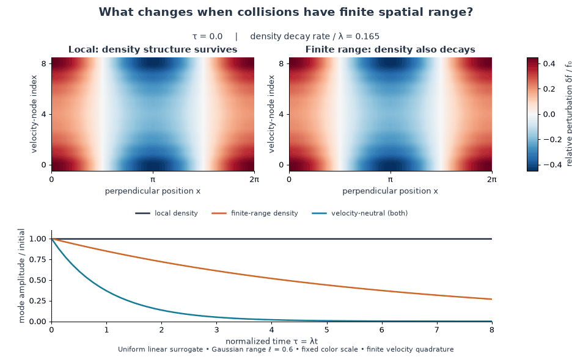
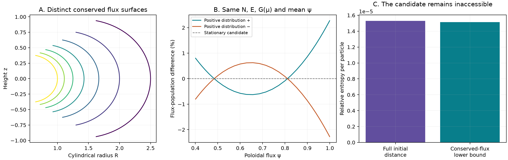
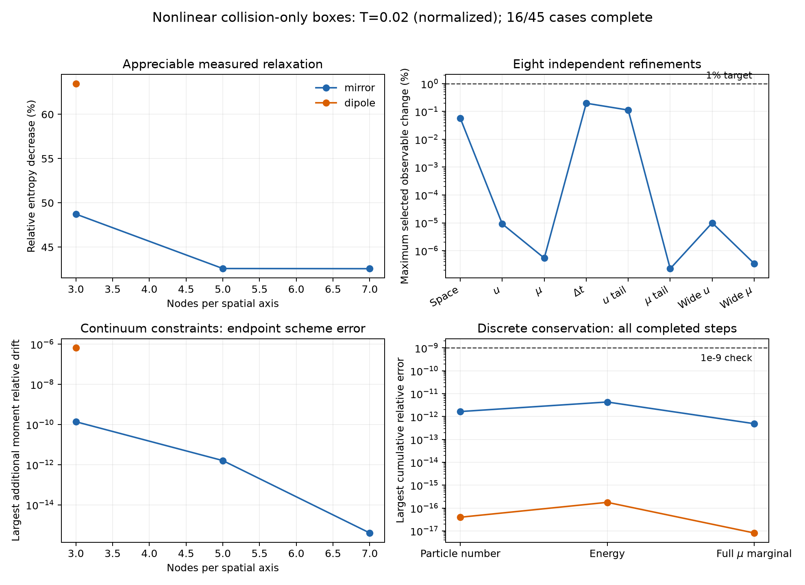

# Sato–Morrison collision prototypes

JAX experiments on **what relaxes—and what remains frozen—when collisions preserve magnetic moment**. Based on [Sato & Morrison (2025)](https://doi.org/10.1063/5.0289410), with independent numerical and collision controls.

[Run the code](#run) · [All examples](examples/README.md) · [Derivations & literature](notes/implementation.pdf) · [Validation ledger](results/validation.csv)



**Interaction range changes the nullspace.** Same initial perturbation, same color scale. The local density pattern survives; finite range damps it. Time uses a prescribed coefficient. [MP4](results/visual_summary/range_evolution.mp4) · [Data and checks](results/visual_summary/metadata.json) · [Script](examples/09_visual_summary.py)

## Results

| Check | Measured result |
|---|---|
| Eq. (181), uniform field | Independent pair calculation agrees to **2.36e−16** |
| Toroidal streaming + collisions | Eight final refinement changes below **0.71%**; all **39** collision null modes explained on the 243-node grid |
| Nonlinear mirror evolution | **15 runs**, eight refinement checks; largest final change **0.197%** |
| Independent solver audit | All **20 saved steps** rechecked with a separate NumPy pair operator |
| Conditional scattering table | Fresh **4,096-state** test: p95 error **2.54%**, confidence interval **2.06–3.37%** |
| Test suite | **193 passed** on fresh Linux CI |

[Reproduction record](results/deep_reproduction.json) · [Mirror data](results/nonuniform_entropy/mirror_audit.json) · [Solver audit](results/solver_accuracy/audit.json) · [Scattering audit](results/scattering_table/refined8_validation4096/audit.json)

### The uniform-field oracle

![C_L[delta f] = D/(qB)^2 times the perpendicular Laplacian of (n_0 delta f minus f_0 delta n); lambda = D n_0 k_perp^2/(qB)^2.](results/visual_summary/uniform_oracle.svg)

Density-like and spatially homogeneous modes are undamped. A perpendicular, density-neutral Fourier mode decays at the rate shown above. The nonlinear kernel is a **simplified surrogate**, not the full source Eq. (119). [Equations and assumptions](notes/implementation.pdf) · [Oracle test](examples/00_uniform_reference.py) · [Equation figure](examples/09_visual_summary.py)

### A dipole remembers more than its mean flux



The full flux distribution supplies additional constraints. Two populations can match the usual invariants and still be unable to reach the same stationary state. The constructed relative-entropy floor is **1.5141e−5 per particle**; joint quadrature refinement changes it by **1.1e−10** relatively. This is a negative result for the local surrogate; publication priority remains unresolved. [Construction](examples/15_dipole_obstruction.py) · [Evidence](results/dipole_obstruction/summary.json)

### Refinement matters



The mirror campaign passes, but its coarse timestep retains **2–3% bias**. Finest-pair agreement does not certify a coarse run. **One dipole solve was rejected; remaining dipole and nonaxisymmetric cases are running.** [Complete histories and pending cases](results/nonuniform_entropy/summary.json) · [Script](examples/12_nonuniform_evolution.py)

## Run

```sh
git clone https://github.com/rogeriojorge/sato-morrison.git
cd sato-morrison
python3.12 -m venv .venv
source .venv/bin/activate
python -m pip install -e '.[dev]'
python -m pytest -q
MPLBACKEND=Agg python examples/00_uniform_reference.py
MPLBACKEND=Agg python examples/01_relaxation.py
```

[Twenty editable examples](examples/README.md) cover geometry, nonlinear evolution, Lorentz/Dougherty controls, physical 3V Landau weak moments, encounters, convergence, derivatives and benchmarks. Scripts enable float64, print progress and reject failed solves. SOLVAX supplies linear algebra; no other UW Plasma physics code is required.

## Cost and scope

At matched error on an Apple M4, the small implicit benchmark takes **43.8 μs** with diagonal-PCG versus **550 μs** dense; temporary buffers are **16.8 kB** versus **263 kB**. These are synchronized warm medians, not a general nonuniform speedup. [Measurements](results/benchmarks/summary.json) · [Benchmark script](examples/05_benchmarks.py)

| Implemented and checked | Still open |
|---|---|
| Uniform nonlinear and toroidal combined dynamics | Joint continuum convergence of all nonuniform boxes |
| Mirror, dipole and nonaxisymmetric collision-only boxes | Confined dipole dynamics with compatible ideal boundaries |
| Lorentz, Dougherty and physical 3V Landau references | A general Landau time integrator |
| Direct magnetized encounters; bounded interpolation | A calibrated kinetic coefficient or dipole lifetime |

The scattering table passes its distributional target, but **8 of 4,096 states still exceed 100% relative error**. Wider impact/speed coverage remains unresolved. No physical spectral gap or metastable regime is claimed. The [40-page notes](notes/implementation.pdf) contain derivations, literature comparisons and the limits of each result; [source](notes/implementation.tex) and [bibliography](notes/references.bib) are included.

## License

Original code, notes, figures and measured data: [MIT](LICENSE). Scientific attribution is retained in the [bibliography](notes/references.bib). Third-party PDFs stay outside this repository.
