# Sato–Morrison collision prototype

Conserving magnetic moment restricts how a plasma can relax. This fixed-field JAX prototype follows [Sato & Morrison (2025)](https://doi.org/10.1063/5.0289410), reproduces their local linear Eq. (181), and studies explicit nonlinear and finite-range extensions. Numerical values below use normalized units.

## Magnetic coordinates

A charged particle spirals around a magnetic field. Averaging over that rapid orbit gives a guiding center. Its state consists of position **X**, signed parallel velocity **u**, and magnetic moment **μ**. The distribution **f(X,u,μ,t)** counts guiding centers in phase space.


Here **m** is mass, **q** is charge and **B** is field strength. Magnetic moment measures perpendicular kinetic energy divided by B. Ideal motion approximately preserves μ when the gyroradius and gyroperiod are small compared with the field's spatial and temporal scales. The constrained collision operator preserves μ exactly.


The transport terms move particles through the prescribed field; **C[f]** redistributes their population through collisions. For the vacuum fields used here, the volume element is **B d³X du dμ**. Most nonuniform runs isolate C[f]. The toroidal calculation also includes compatible ideal motion.

## Conservation constraints

The operator conserves number, total energy and the entire magnetic-moment distribution **G(μ)**. Each μ bin retains its population after integrating over position and parallel velocity.


Both populations above have N = 1 and mean μ = 1.5. Their bin populations differ, so magnetic-moment-preserving collisions cannot connect them. Entropy can increase within the permitted states; the constraints and the operator's nullspace determine which states are accessible.

## Uniform field: exact solution

Write a small perturbation as a density modulation of the homogeneous reference **f₀**, plus a remainder **g** whose velocity integral vanishes. In the local linear model, the density modulation survives and the remainder diffuses across the field.


Here n₀ and δn are velocity integrals with measure B du dμ; k⊥ is the perpendicular wavenumber. The calculation assumes constant electric potential and collision-only evolution. **D is a prescribed coefficient**, so the time axis is normalized model time.


In the finite-range extension, a Gaussian interaction range **a** changes the density-branch rate to **λρ = λ[1 − exp(−a²k⊥²/2)]**. Since λ scales as k⊥², the long-wave density rate scales as k⊥⁴. The shape branch retains rate λ. The plotted range gives λρ/λ = 0.165.


Rows represent velocity-quadrature nodes. The animation uses saved operator evolution checked against the exact modes; maximum discrepancy is **3.08×10⁻¹⁵**. [Inputs and arrays](results/visual_summary/metadata.json)

## Discrete nonlinear model

The nonlinear kernel acts on differences of guiding-center derivatives. **Aᵢh** is the discrete action of J∇h, expressed in a common Cartesian η = μB chart. Here **J** is the guiding-center Poisson matrix. The energy direction ξ uses the same derivative as every test function. Projecting perpendicular to ξ enforces discrete energy conservation.


The positive weights ωᵢⱼ contain quadrature and, for nonlocal interactions, the spatial range kernel. The diagonal matrix selects the three spatial components before energy projection. Local pairs share one position. Each unordered pair enters once. The uniform zero-direction limit is derived analytically; an unresolved zero direction in a nonuniform field causes an error.

Source Eq. (119) closes a pair distribution into two species distributions and retains a full interaction tensor. The displayed Q defines the project's simpler nonlinear kernel. Eq. (181) supplies the uniform linear reference.

## Implicit time integration

Let **nᵢ = wᵢfᵢ** be a node's population, with positive quadrature weight wᵢ. The matrix K is symmetric and positive semidefinite. Its null vectors include the constant, discrete energy and every μ-bin indicator χₐ.


Small nonlinear reference problems use a second-order discrete-gradient step. The large nonuniform runs use the displayed first-order step, freezing K at the old density. Newton corrections use matrix-free Hessian products and SOLVAX PCG. Acceptance checks include the true linear residual, nonlinear residual, positive population and objective decrease. Failed steps raise an error and retain their last accepted state.

## Comparing collision operators

Start every model from the same uniform plasma: perpendicular temperature **T⊥ = 1.15**, parallel temperature **T∥ = 0.7**, zero mean velocity and **n = m = B = 1**. Here F is the density in all three physical velocity dimensions.

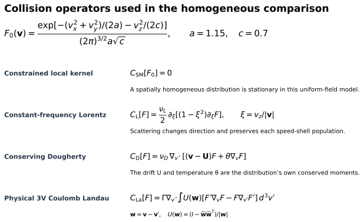

We match the initial pressure-anisotropy decay of Lorentz and Dougherty to the independently calculated Landau slope: **α = 0.493595**, **νL = α/3**, **νD = α/2**, **τ = αt**. This choice makes their entire pressure curves coincide. The uniform constrained state remains stationary.

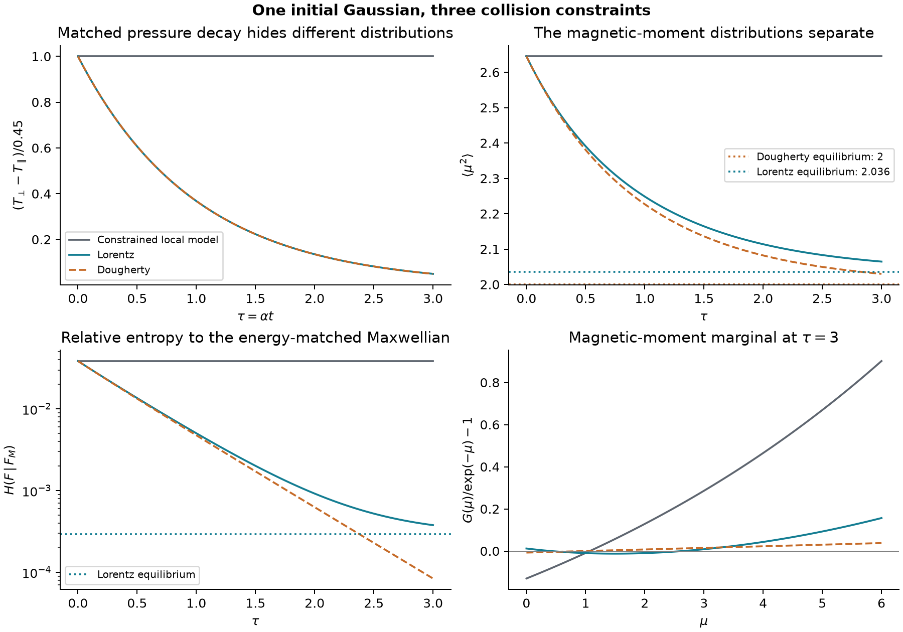

Pressure alone misses the difference. Lorentz preserves the number of particles at every speed and approaches an isotropic, non-Maxwellian distribution. Dougherty redistributes speeds and approaches a Maxwellian. Their limiting **⟨μ²⟩** values are **2.036** and **2**, respectively; the constrained model retains **2.645**. Lorentz retains a relative-entropy distance **H = 2.94145×10⁻⁴** from the Maxwellian.

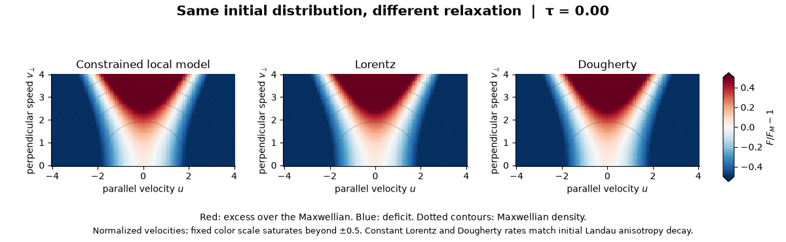

Red shows excess population relative to the energy-matched Maxwellian; blue shows a deficit. The plots use analytical mode-time factors and checked angular reconstruction. Final quadrature, tail and angular refinements change the reported observables by less than **6×10⁻¹²** in normalized units. A coarse angular reconstruction that produced negative tail densities remains recorded as a failure. [Inputs, arrays and checks](results/operator_comparison/summary.json)

The initial higher-moment rates already distinguish the conventional operators. Here μ = (vₓ² + vᵧ²)/2, and the Landau coefficient is Γ = 1 in normalized units:

| Initial rate | Constrained | Lorentz | Dougherty | Physical 3V Landau |
|---|---:|---:|---:|---:|
| Pressure anisotropy | 0 | −0.222118 | −0.222118 | −0.222118 |
| Mean squared magnetic moment | 0 | −0.340581 | −0.340581 | −0.260753 |
| Fourth speed moment | 0 | 0 | −0.266541 | −0.133271 |

The Landau entries have independent Gaussian integral checks. Its nonzero fourth-cumulant rates also show that the evolving distribution leaves the Gaussian family. [Initial-rate derivation and evidence](results/operator_comparison/physical_initial_rates.json)

The Lorentz frequency here is constant; physical Coulomb deflection has a speed-dependent frequency. Matching one initial slope is a comparison convention and supplies no physical Sato–Morrison coefficient. The full Landau density solver passes independent finite-grid matrix, nullspace, conservation, entropy and timestep-order checks. The velocity-space consistency test below determines how much those checks establish. [Independent 3V matrix audit](results/landau_evolution/independent_gram_audit.json)

### Checking the full Landau collision term

A collision operator moves particles between velocities. Red regions below gain population; blue regions lose it. Starting from the same Gaussian, we can calculate this initial redistribution independently through a one-dimensional Coulomb integral. The other panels apply the discrete Landau operator to that distribution.

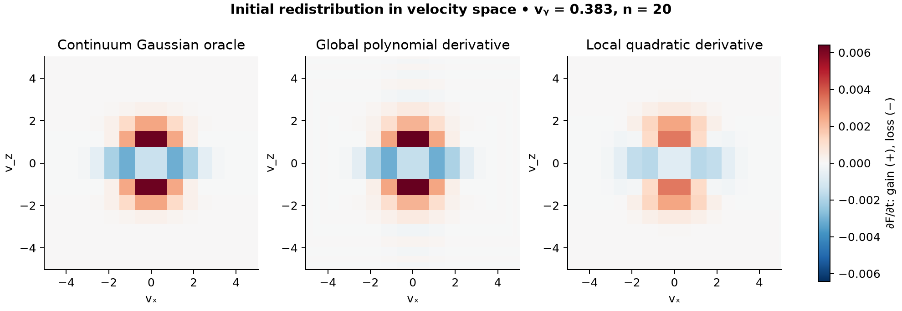

Matching a few moments can conceal distribution errors. Both derivatives conserve number, momentum and energy and give the same initial pressure rate. At **20³ nodes**, that rate has **0.86% error**, while the full collision-term errors are **9.67%** and **39.39%**. The error measure integrates the absolute difference over physical velocity volume and divides by the reference collision term’s absolute integral.

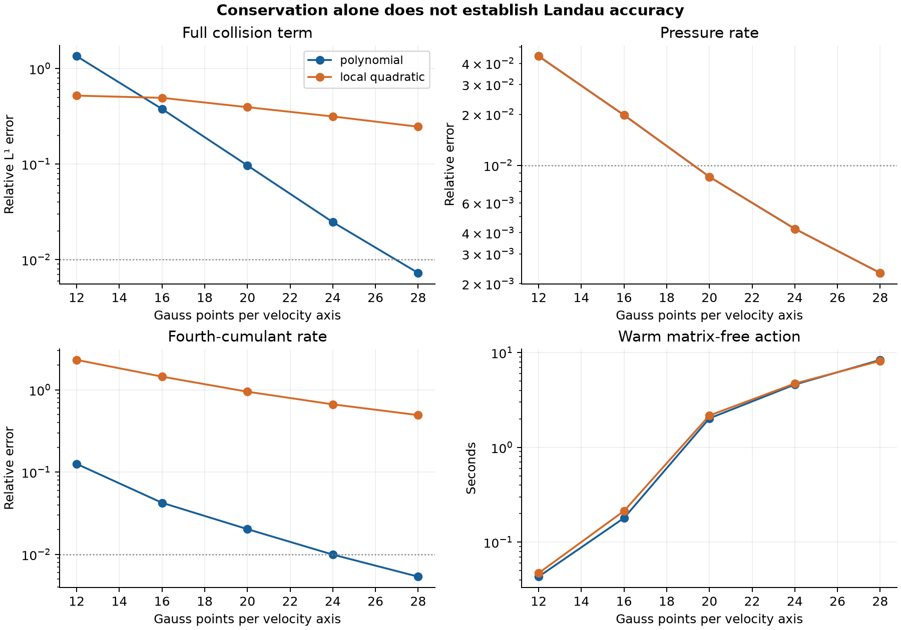

At **28³ nodes**, polynomial differentiation reaches **0.73% full-term error**, **0.23% pressure-rate error** and **0.54% fourth-cumulant-rate error**. Large relative errors remain at low-density tail nodes. The local quadratic option still has **24.59% full-term error**. It is retained as a diagnostic of the difference between conservation and accuracy. The polynomial action takes **8.38 s** on the recorded M4 run; the two methods have not reached matched accuracy, so their timings establish no speedup.

An independent diagnostic supplies the exact velocity-space particle flux to each discrete derivative. The local method still has **24.37% error**, close to its **24.59%** total. The main defect is therefore in the finite derivative and boundary reconstruction; refining the collision integral alone will not resolve it. [Flux and derivative checks](results/landau_consistency/independent_flux_audit.json)

These are initial collision terms. Full Landau trajectories still need velocity, tail, timestep and kernel convergence. Example 30 saves every refinement and exits with a visible failure because the declared 1% target is unresolved for the local option. [Inputs and measured errors](results/landau_consistency/summary.json) · [Independent array audit](results/landau_consistency/independent_audit.json) · [Independent continuum derivation and checks](results/landau_evolution/independent_strong_audit.json)


### Evolving the full Landau distribution

A Gaussian is useful for checking the initial collision term. During relaxation, each velocity node has its own density; the solver does not constrain the distribution to remain Gaussian. Gauss–Hermite nodes put more resolution near the populated velocities. Their integration weights are converted to physical velocity volume before assembling the Coulomb operator.

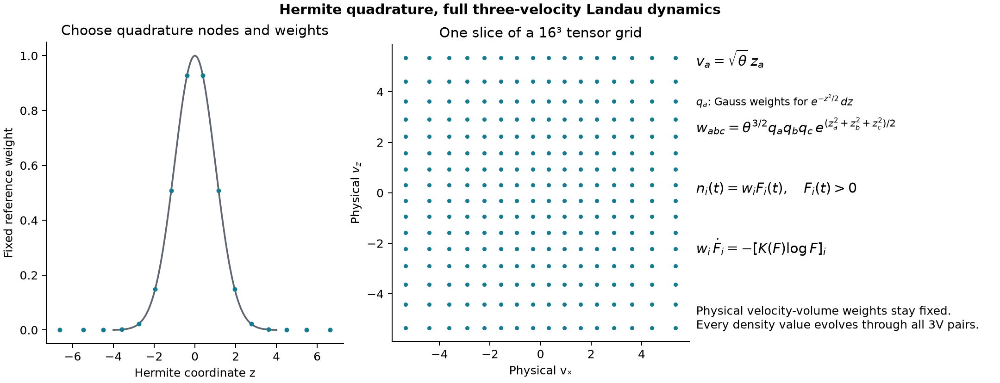

At scale **θ = 0.65**, the initial full-term error is **0.652% on 16³ nodes** and **0.419% on 20³ nodes**. The quadrature scale controls where velocities are sampled; it is independent of the plasma temperature. The derivation and weighted integration-by-parts check are in the [technical notes](notes/implementation.pdf).

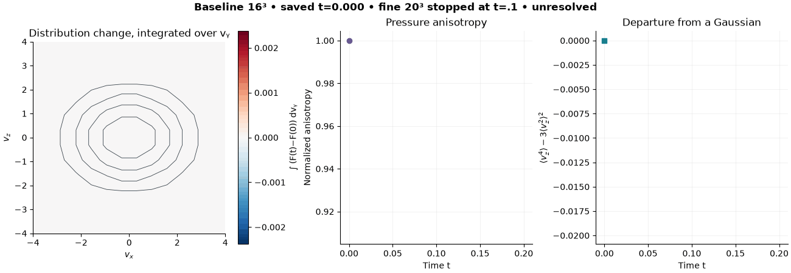

The movie shows four accepted **16³-node** steps to **t = 0.2**. Pressure anisotropy falls from **0.45 to 0.409189**. The fourth cumulants become nonzero, resolving the departure from a Gaussian. The finer **20³-node** campaign reaches **t = 0.1** before its capped Newton iteration stalls. Both sets of accepted states are preserved.

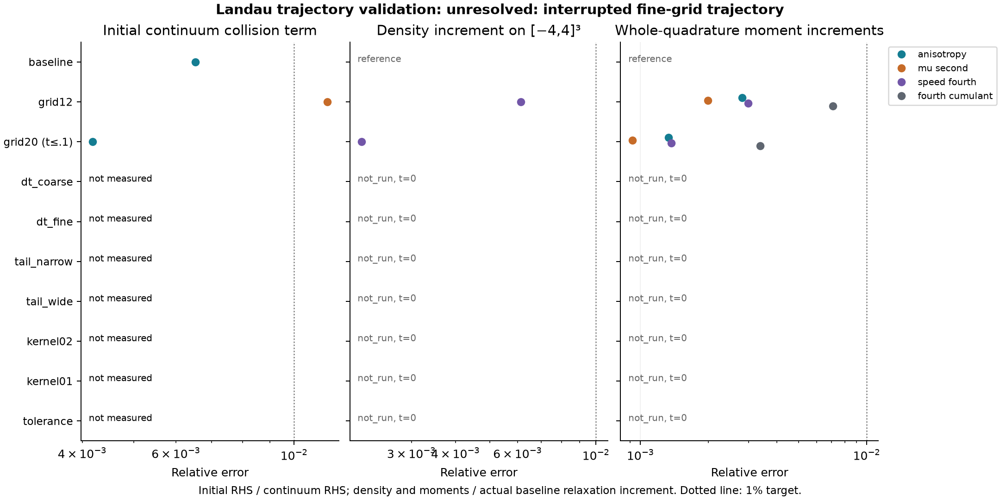

Over the shared interval, the two grids differ by about **0.22% of the actual density change**, including an independent comparison on the larger velocity cube **[−5,5]³**. Every saved step passes an independent replay of its discrete equation, conservation and entropy balance. Timestep, tail, kernel and complete fine-grid checks remain necessary before reporting a converged four-operator trajectory. [Saved states and failures](results/landau_trajectory/summary.json) · [Independent stage checks](results/landau_trajectory/independent_allstage_audit.json) · [Larger-box comparison](results/landau_trajectory/independent_expanded_box_audit.json)


## Fields, boundaries and simulations

| Field | Domain and boundary treatment |
|---|---|
| Uniform | Periodic perpendicular coordinate; exact Fourier controls |
| Harmonic mirror | Cartesian box; natural zero collision flux |
| Vacuum toroidal | Cylindrical coordinates with the R Jacobian; periodic angle and tangent ideal motion |
| Dipole | Cartesian box excluding the field singularity; natural zero collision flux |
| Controlled nonaxisymmetric | Vacuum perturbation of the dipole; the same collision-only box treatment |

For fixed μ, perpendicular energy is **E⊥ = μB**: the same moment represents different energies where the field is stronger or weaker. The orange box marks the dipole domain used below.

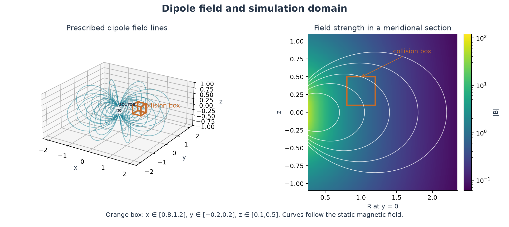

The three-field pilot starts from **f = exp[−E − 0.2μ + 0.1u sin(πy/0.4)]** on x ∈ [0.8,1.2], y ∈ [−0.2,0.2], z ∈ [0.1,0.5], u ∈ [−4,4], μ ∈ [0,20]. It uses **5³ × 25 × 13 = 40,625 nodes**, D = 0.1 and four steps of Δt = 0.005.

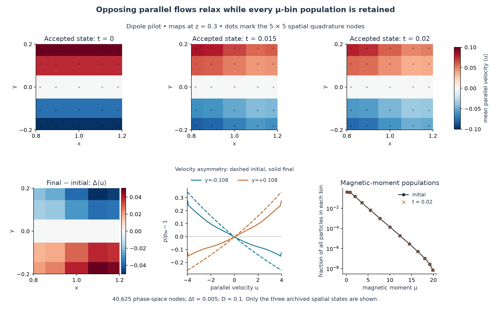

Red and blue regions flow along and against the local field. Their speeds weaken unevenly across the box. The lower curves show the local velocity density **p(u|X)** relative to the normalized Gaussian **pM ∝ exp(−u²/2)**. Every global μ-bin population is retained to **2.22×10⁻¹⁵** relatively. Dots mark the spatial quadrature nodes; the three maps are the archived states at **t = 0, 0.015, 0.02**. [Plotted arrays and checks](results/spatial_relaxation/summary.json)


Here **H = Σᵢ wᵢ[fᵢ log(fᵢ/f⋆ᵢ) − fᵢ + f⋆ᵢ]**, with f⋆ proportional to exp(−E − 0.2μ) and normalized to the same particle number. It measures departure from this stationary reference, which need not be reachable. The curves use the accepted steps' entropy changes and the conserved moments. Independent pair calculations check the final residual and entropy identity. Two preconditioners agree within **1.50×10⁻¹²** in the weighted log-density norm. [Pilot comparison](results/nonuniform_spatial_blocks/preconditioner_comparison.json)

The mirror has a separate **15-run refinement study**: eight final observable changes are below 1%, with a maximum of **0.197%**. Coarse timesteps retain **2–3% bias**. Dipole and nonaxisymmetric grid/tail/timestep refinement is unfinished; the current campaign includes rejected steps in extreme tails. [Refinement ledger](results/nonuniform_spatial_blocks_full/summary.json)

## Geometry-dependent constraints

In the local dipole model, collisions preserve the population on each magnetic flux surface. Two distributions can therefore agree in number, energy, G(μ) and mean flux while retaining different flux distributions.


This construction gives a relative-entropy floor of **1.5141×10⁻⁵ per particle**. Joint quadrature refinement changes the bound by **1.1×10⁻¹⁰** relatively. The result applies to the specified local collision model and domain. A physical confinement lifetime still requires compatible ideal boundaries and calibrated collision physics.


The mixed moment is conserved on an angular patch. Its angle dependence prevents a periodic extension; separated-pair interactions and ideal motion also change it.


The finite-grid spectra retain every null mode. Three extra axisymmetric polynomial modes vanish at the sampled angular nodes; four-node quadrature detects their nonzero variation between nodes. They cannot be discarded to infer a continuum spectral gap.

## Direct particle encounters

Two repelling particles in a uniform field provide a physical check on magnetic-moment conservation. The incoming speeds and orbit-center separation are fixed while the phase around the spiral varies.

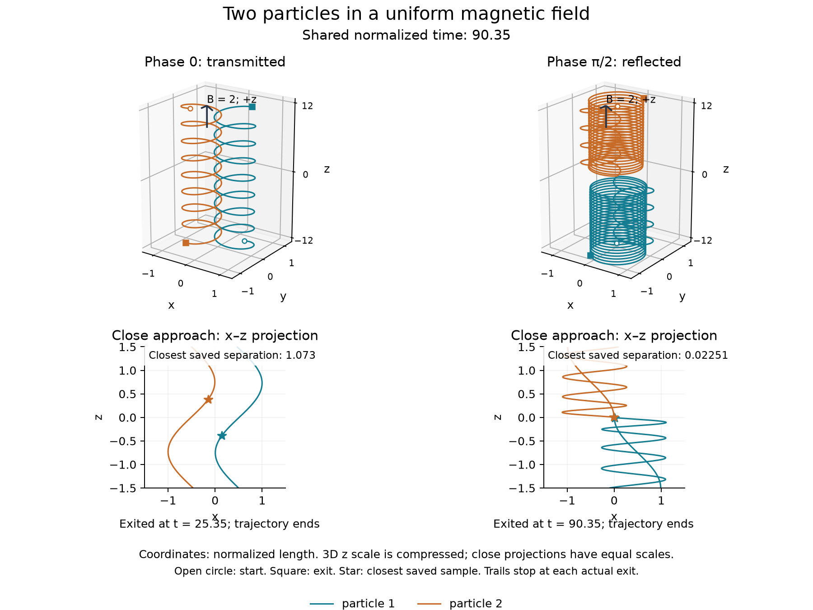

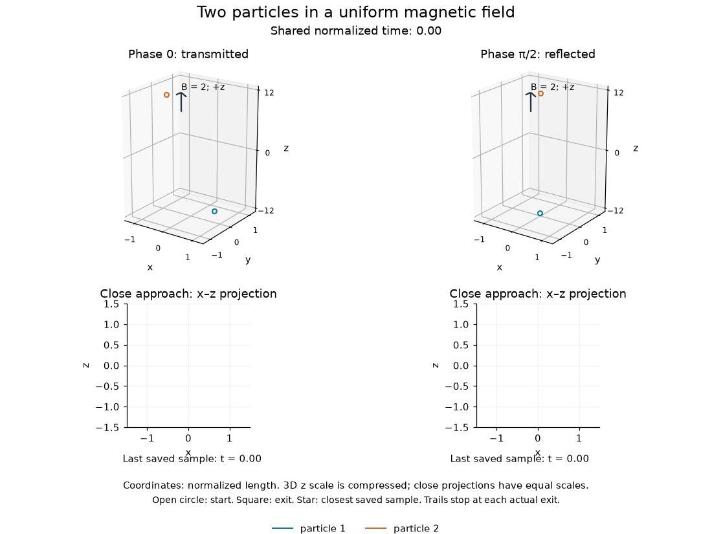

The left pair transmits; the right pair reflects. The lower projections resolve the close approach on equal spatial scales. The upper views compress the long z direction. Both encounters use the same clock, and each path stops at its outgoing event.


One path transmits at **t = 25.35**; the other reflects at **t = 90.35**. Their final magnetic moments are **1.020** and **1.912** times their initial values. Each curve stops at its outgoing event. These zero-center-of-mass paths lie outside a verified adiabatic/grazing regime. [Trajectory inputs and checks](results/encounter_movie/summary.json)

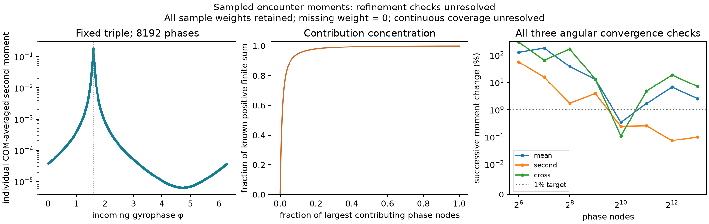

The extended calculation averages over Gaussian center-of-mass velocities and **8,192 incoming angles**. Subscripts label the two particles. The angular target requires two successive changes below 1%; the whole-grid half-step target is 0.1%.

| Averaged quantity | Angular change, 4,096 → 8,192 | Step change, 0.05 → 0.025 |
|---|---:|---:|
| Mean change, ⟨Δμ₁⟩ | **2.56%** | 5.90×10⁻⁸% |
| Squared change, ⟨(Δμ₁)²⟩ | 0.100% | 2.61×10⁻⁸% |
| Cross moment, ⟨Δμ₁Δμ₂⟩ | **7.14%** | 4.82×10⁻⁷% |

The mean and cross moment remain angularly under-resolved. **22 of 24** independent Cartesian trajectory checks pass; both checks at one newly selected angle fail and remain in the data. The run takes **477.4 s**, with **476.0 MB** peak process memory on the recorded M4. It exits nonzero. [Inputs, every trajectory and checks](results/encounter_phase/all_moments8192/summary.json)

The earlier 2,048-angle study passed its narrower second-moment criterion. That result is preserved in the [refinement history](results/encounter_phase/refined8192/summary.json). Continuous angular coverage and a physical collision rate remain unresolved.


Near the boundary between transmission and reflection, refined trajectories disagree by tens to hundreds of length units despite energy errors near **10⁻¹²**. One predicted reflection becomes transmission. The exact flow's continuity implies slow intermediate trajectories between true opposite exits, but the finest computed bracket fails its trajectory checks. No trapping classification or collision rate follows from these data.

The physical 3V Landau Gaussian weak-moment reference has independent spherical and Laplace calculations agreeing to **4.14×10⁻¹⁴**. This checks instantaneous rates. Convergence of full Landau trajectories and plasma-rate calibration remain open.

## Runtime, memory and failure diagnostics

A preconditioner approximates the linear system used in each Newton correction. `xline` couples one spatial direction; `xyz` couples all three.


For the same frozen correction and **10⁻⁷** error target, three-repeat medians are **210.1 s** (`xline`) and **51.7 s** (`xyz`). Temporary buffers occupy **163.8 MB** and **241.8 MB**. These measurements used a shared M4 under varying load; complete-trajectory speedup has not been established. [All repeats, reference checks and memory accounting](results/difficult_correction/summary.json)


On this ray, exponentiation returns zero for trial tail populations and the positivity guard rejects them. A separate **300-second** continuation with 60 backtracks admits tiny updates but leaves the residual near **2.887**, against a **10⁻¹²** target. It accepts no second timestep. The recorded failures, rounded-update audit and partial states remain in the repository.

## Reproduce

```sh
git clone https://github.com/rogeriojorge/sato-morrison.git
cd sato-morrison
python3.12 -m venv .venv
source .venv/bin/activate
python -m pip install -e '.[dev]'
python -m pytest -q
MPLBACKEND=Agg python examples/00_uniform_reference.py
MPLBACKEND=Agg python examples/01_relaxation.py
MPLBACKEND=Agg python examples/22_first_principles.py
MPLBACKEND=Agg python examples/24_encounter_phase.py
MPLBACKEND=Agg python examples/27_encounter_movie.py
MPLBACKEND=Agg python examples/28_spatial_relaxation.py
MPLBACKEND=Agg python examples/29_operator_comparison.py
# Saves the underresolved Landau study, then exits with a declared accuracy failure:
MPLBACKEND=Agg python examples/30_landau_consistency.py
# Run the declared trajectory refinements in a new output directory:
SM_LANDAU_OUTPUT=results/landau_reproduction MPLBACKEND=Agg python examples/31_landau_trajectory.py
# Independently replay the archived accepted Landau stages:
SM_LANDAU_AUDIT_OUTPUT=results/landau_archived_audit.json python examples/32_landau_audit.py
```

Example 24 exits nonzero because the declared angular and Cartesian checks remain unresolved. It saves the results before raising the error.

**261 tests pass on fresh Linux CI.** Examples expose their inputs, print progress and fail visibly when a declared check fails. Saved results record inputs, units, producer commit, versions and hardware. Computation uses JAX and SOLVAX with independent NumPy/SciPy controls; no other UW Plasma physics package is required.

| Capability | Current evidence |
|---|---|
| Uniform Eq. (181) | Independent pair agreement **2.36×10⁻¹⁶**; exact limits and timestep convergence |
| Nonlinear constrained evolution | Number, energy, full μ marginal, entropy, positivity and solver-failure tests |
| Toroidal decay | Eight final refinement changes below **0.71%**; all **39** sampled collision nulls explained |
| Nonuniform evolution | Completed three-field pilots and mirror refinement; dipole/nonaxisymmetric refinements remain open |
| Collision-model comparison | Shared initial data for constrained, Lorentz and Dougherty evolution; independently checked initial 3V Landau rates |
| Landau evolution | Full 3V nodal density; structural checks and initial continuum comparison; converged trajectories remain open |
| Physical encounters | Independently checked binary trajectories; angular and rate-calibration limits retained |
| Physical rates and lifetimes | Uncalibrated; no metastable regime or dipole lifetime established |

The [example catalogue](examples/README.md), [validation ledger](results/validation.csv), [reproduction record](results/deep_reproduction.json) and [technical notes](notes/implementation.pdf) contain the complete commands and derivations. [LaTeX source](notes/implementation.tex) · [Bibliography](notes/references.bib). Original project material is [MIT](LICENSE); third-party papers are stored outside the public repository.
