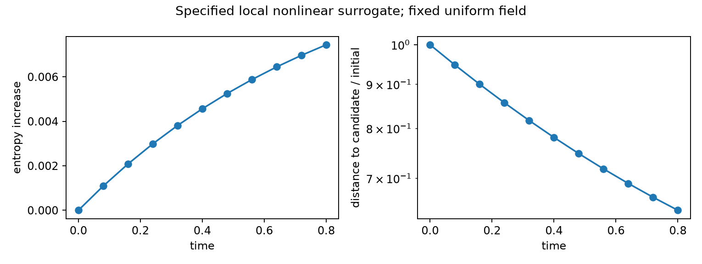

# Magnetic-moment-constrained collision prototypes

A small JAX research code that tests what the specified Sato–Morrison collision kernels relax, which null modes survive, and where a magnetic-moment constraint needs independent physical evidence.

## Model

The state is `f(X,u,mu)` in a prescribed vacuum field, with measure
`dGamma = B d³X du dmu` and energy `E = m u²/2 + mu B + q Phi`.
The nonlinear weak surrogate is

\[
\int\phi C[f]d\Gamma=-\tfrac12\iint ff'\,\Delta\phi^T\Pi\Delta\ln f\,d\Gamma d\Gamma',
\quad \Delta\phi=J\nabla\phi-J'\nabla'\phi',\quad \Pi=D P I_X P.
\]

Pair vectors are evaluated in the same normalized Cartesian `(X,u,eta=mu B)` chart. Local quadrature uses **two velocity Jacobians**. The discrete projector uses the same discrete energy derivative as the weak form. It therefore preserves discrete energy exactly, while approaching the source projector under refinement. The uniform directional limit is analytic; undefined nonuniform zero directions raise an error.

- `sm181_local`: fixed-field linear local scalar approximation to Eq. (181), with constant prescribed `D`.
- `sm_local_nonlinear`: the stated nonlinear extension of this simplified weak kernel, **not the full source Eq. (119)**.
- `sm_finite_range`: a symmetric, normalized spatial-kernel surrogate; no Coulomb scattering tensor is inferred.
- `lorentz`: speed-shell Legendre pitch scattering; momentum exchanges with a reservoir.
- `dougherty`: conserving homogeneous nonlinear evolution of positive Gaussian mixtures, checked against the strong equation.
- `landau`: independently checked physical **3V Coulomb weak moments**, including a nonGaussian pair evaluator; not a full Landau time integrator.
- `encounter`: direct equal-charge, equal-mass repulsive two-body Lorentz-force trajectories.

The constrained weak scheme conserves number, fixed-field energy, and every resolved magnetic-moment-bin population. Its nonlinear discrete-gradient step conserves those quantities and increases entropy to the nonlinear residual bound. Logarithmic unknowns enforce positive nodal values; spatial reconstructions are also checked in the reported evolution examples. No populations are clipped or repaired after stepping.

## Install

```sh
git clone https://github.com/rogeriojorge/sato-morrison.git
cd sato-morrison
python3.12 -m venv .venv
source .venv/bin/activate
python -m pip install -e '.[dev]'
python -m pytest -q
```

Scientific checks use float64. Executable examples enable JAX x64; package import does not change global precision. Only SOLVAX is used from UW Plasma, for general linear algebra. No other UW Plasma physics code is imported.

## Run

```sh
MPLBACKEND=Agg python examples/00_uniform_reference.py
MPLBACKEND=Agg python examples/01_relaxation.py
MPLBACKEND=Agg python examples/02_geometry.py
MPLBACKEND=Agg python examples/03_controls.py
MPLBACKEND=Agg python examples/04_encounters.py
MPLBACKEND=Agg python examples/05_benchmarks.py
MPLBACKEND=Agg python examples/06_range.py
MPLBACKEND=Agg python examples/07_equilibria.py
MPLBACKEND=Agg python examples/08_fields.py
```

These are editable top-level scripts with explicit inputs, progress messages, diagnostics, plots and saved results. They also run from another working directory after installation. Failed solves raise with diagnostics. Compilation is announced separately from timed warm execution; long phases print elapsed-time heartbeats.

## Validation

A fresh environment passes **58 tests**, and all nine examples are executed from outside the repository. The tests check the continuous geometry, the actual unmodified weak matrix, and independent reference equations. Coverage includes both charge signs; rotations; uniform, harmonic-mirror, vacuum-toroidal, dipole and nonaxisymmetric vacuum fields; Jacobi and Liouville identities in both charts; pair symmetry/PSD/energy degeneracy; ordered versus unordered counting; dense versus matrix-free actions and chunk sizes; nonlinear linearization; full marginal conservation; entropy divided differences; positivity; and solver failures. An independent harmonic-mirror orbit shows fourth-order timestep convergence.

The uniform reference is

\[
C_L[\delta f]=\frac{D}{(qB)^2}\nabla_\perp^2(n_0\delta f-f_0\delta n),
\qquad\lambda=\frac{Dn_0k_\perp^2}{(qB)^2}.
\]

All homogeneous velocity perturbations and local density-like modes are collision null modes. For a nonzero perpendicular Fourier mode, the entropy-weighted spectrum has exactly one zero and `Nv-1` copies of `-lambda`. Homogeneous isotropization is consequently an inappropriate test of this local operator.

A full toroidal annulus evolves a resolved distribution using collision-only, ideal-only and combined dynamics. The field is `B=C e_theta/R`, the measure is `R B dR dtheta dz du dmu`, and Hamiltonian characteristics satisfy
`Rdot=udot=mudot=0`, `thetadot=u/R`, `zdot=(m u²+mu B)/(q C)`.
Periodic angle/height and tangent radial walls close the ideal budgets; the collision weak form has natural no-flux radial/velocity boundaries. The toroidal projector uses Cartesian eta vectors, not a newly defined cylindrical Euclidean metric.

Mirror, dipole and nonaxisymmetric boxes have **collision-only** evolution and natural collision no-flux boundaries. Their spatial production scans pass the reported refinement target; full velocity/tail convergence and combined confined evolution in those boxes are not established. The known `B/(B+gamma)` density family is checked independently by velocity integration for all five fields. A full-marginal constrained equilibrium multiplier is solved separately, without asserting that extra-nullspace dynamics reaches that candidate.

## Results

Compact numeric data and complete inputs are in `results/`; [validation.csv](results/validation.csv) maps 62 criteria to evidence and explicitly records unresolved or unrun physical requirements. Each experiment records units, source commit, source digest, package versions, processor and device; a nonempty source-change field marks exploratory runs. The committed evidence is regenerated from the recorded source revision before final reporting.

| Comparison | Executed evidence |
|---|---|
| Eq. (181), 216 velocity nodes | Pair/oracle relative error `2.36e-16`; rate `0.1174260355` |
| Uniform backward Euler | Four timesteps; finest rate error `3.67e-4`; first-order convergence |
| Nonlinear constrained uniform model | Number/energy/full-marginal errors below `1e-15`; positive reconstruction; entropy identity checked |
| Nonlinear timestep refinement | Successive errors `7.10e-6`, `1.77e-6`; observed order `2.00` |
| Toroidal combined dynamics | `Q/Q0=0.8109803`; every independent final refinement changes dissipated fraction by less than `0.71%` |
| Lorentz | Legendre rates `0, nu, 3nu, 6nu`; speed-shell count/energy conserved |
| Dougherty | NonGaussian strong-equation check and independent quadrature of drift/covariance/entropy |
| 3V Landau | Spherical Coulomb moments versus independent Laplace integral; Cartesian, tail, gyrophase and near-diagonal refinement |
| Nonuniform collision boxes | All three geometries preserve number/energy/marginal; final spatial production changes below `0.34%` |
| Finite range | 27 grid/range/velocity cases; finest density-rate error `3.03e-13` |



Script: `examples/01_relaxation.py`; data in `results/relaxation.json`. Distance to a candidate maximum-entropy state is an observable, not a uniqueness or attraction claim.

### Candidate result: finite interaction range changes the nullspace

For a homogeneous uniform field and a normalized symmetric spatial kernel with Fourier ratio `r(k)`, the exact finite-velocity-quadrature collision spectrum is

\[
\lambda_{\rm neutral}=\lambda,\qquad
\lambda_{\rm density}=\lambda[1-r(k)].
\]

For a periodized Gaussian of width `ell`, `r(k)=exp(-ell²|k|²/2)`. Thus finite range lifts the local density null mode and produces **quartic transverse long-wave decay**, while every homogeneous velocity perturbation remains undamped. Direct ordered-pair Gram assembly checks the formula without deleting eigenvalues. The local limit is singular in its nullspace; unresolved narrow kernels produce large rate errors. This is an independently checked surrogate result. Related metriplectic and nonlocal relaxation literature was searched; publication priority remains unresolved. No continuum gap or physical collision rate follows from it.


Script: `examples/06_range.py`; all 27 rows are in `results/finite_range/summary.csv` with context in its JSON file.

### Geometry result: frozen toroidal spatial density

For any smooth spatial-only `phi(X)`, the spatial part of `J grad(phi)` is independent of `u,mu` at fixed position. Its local pair difference has only `u,eta` components. The toroidal energy-flow difference has only spatial components, so `P I_X P` annihilates that observable difference. Local collisions therefore preserve **every spatial population**; combined tangent Hamiltonian dynamics preserves every radial population. This is a proved obstruction to unique relaxation based only on energy and the magnetic-moment marginal. Tests check every represented spatial-bin basis vector.

The raw 243-node entropy-weighted matrix has 39 near-null eigenvalues. Spatial populations together with `c(theta)g(mu)`, `c(theta)E` and `c(theta)mRu` have rank 39 and account for every observed tiny-grid null mode. This finite-grid match does not prove an exhaustive continuum classification. The eigenpair residual is `1.63e-15`.

### Physical audit

Energy conservation does not imply magnetic-moment conservation: in uniform `B`,
`Delta E = (m/2) Delta(u²) + B Delta mu`. The missing parallel-energy term matters. Unbiased increments can also broaden the moment marginal through nonzero variance. The source describes its moment-conservation ordering as a working assumption.

Direct magnetized encounters demonstrate this distinction for specified incoming guiding centers, gyrophases and screened repulsive potentials. Zero-force helices, Rutherford convergence, energy, timestep, gyrophase and incoming/outgoing separation are checked. **There is no incident-flux-weighted plasma rate, held-out kinetic closure, calibrated `D`, or metastable dipole lifetime here.** Full physical validation remains open.

## Performance

`examples/05_benchmarks.py` compares dense, unpreconditioned PCG and diagonal-PCG implicit steps at the same error, with five synchronized warm repetitions and separate compilation/first execution. It also benchmarks the actual pair weak action against an independent dense Gram matrix, varying spatial nodes, velocity nodes and pair chunk size. XLA buffer accounting and measured process peak RSS are recorded separately. RSS is a cumulative process high-water mark, not an isolated workspace measurement.

The exact uniform Fourier reduction is separable and avoids pair work. Its timing must not be extrapolated to a general nonuniform collision kernel. `results/benchmarks/summary.json` records errors, median/spread, iteration counts and memory for each route. CPU measurements are on an Apple M4; no GPU speedup is claimed.


Measured four-block, 128-velocity-node implicit step on Apple M4 (five repeats; identical time-discretization error `2.77e-5`):

| Route | Compile + first (s) | Warm median (µs) | Warm min–max (µs) | XLA temporary bytes |
|---|---:|---:|---:|---:|
| dense | 0.092 | 550.3 | 214.2–1297.8 | 262852 |
| pcg | 0.184 | 571.7 | 273.1–804.7 | 16696 |
| diagonal_pcg | 0.225 | 43.8 | 34.5–126.6 | 16832 |

For 945 explicit weak pairs, chunking by 16 reduces XLA temporary buffers from 118,913 to 16,480 bytes; the measured warm median grows from 96.3 to 158.2 µs on this small case. All action errors are below `8e-16`. Peak process RSS reaches 332 MB in the complete benchmark process; this includes the runtime and compiled executables.

## Structure and notes

Five substantive modules cover geometry, collisions, solvers, independent references and controls. Pair kernels store five-component directions and support bounded application chunks; dense Gram matrices are verification references. The nonlinear prototype uses a dense Newton Jacobian on tractable grids, so it is not yet a scalable large nonlinear solver.

Full derivations, literature review, chart transformations, normalization, discrete conservation proofs and limits are in [the notes](notes/implementation.pdf), with [LaTeX source](notes/implementation.tex) and [bibliography](notes/references.bib). Rebuild the multi-file notes with:

```sh
cd notes
pdflatex -interaction=nonstopmode -halt-on-error implementation.tex
bibtex implementation
pdflatex -interaction=nonstopmode -halt-on-error implementation.tex
pdflatex -interaction=nonstopmode -halt-on-error implementation.tex
```

## Limits

No self-consistent electrostatics, unequal-mass multispecies closure, current-carrying-field bracket, universal nonuniform zero-set prescription, long-time continuum spectral gap, calibrated collision coefficient or dipole confinement claim. Additional toroidal finite-grid null modes are retained and reported. Implicit differentiation is checked for a specified linear solve; general geometry/steady-state sensitivities are not advertised. Physical Landau references evaluate weak moments rather than evolving a general distribution. Encounter convergence does not establish many-body Markovian closure.

## References and license

Sato and Morrison, *Physics of Plasmas* **32**, 102306 (2025), [DOI](https://doi.org/10.1063/5.0289410); Brizard and Sugama, [arXiv:2506.22289v2](https://arxiv.org/abs/2506.22289v2); Kraus and Hirvijoki, [arXiv:1707.01801v2](https://arxiv.org/abs/1707.01801v2); Jose and Baalrud, [arXiv:2008.06080v1](https://arxiv.org/abs/2008.06080v1). See the bibliography for the complete method/source comparison.

Original code, notes, figures and measured data are MIT licensed. Third-party papers retain their own licenses and are **not distributed in this repository**. SOLVAX is an external dependency; no upstream modification was required.
