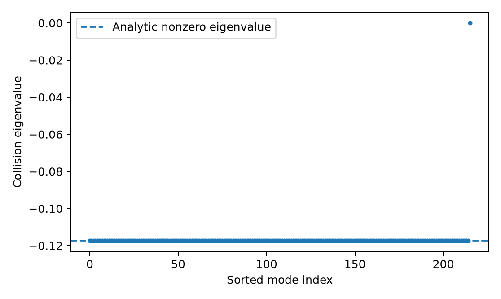

# Sato-Morrison

Reference calculations for magnetic-moment-constrained collision models.

**Current scope:** a NumPy oracle for the uniform-field limit of Sato and Morrison's Eq. (181), with tests and derivation notes. General JAX evolution, nonuniform collisions and physical rate calibration are not implemented yet.

## Model

The reduced state uses guiding-center coordinates `(X, u, eta)`, where `eta = mu B`. The magnetic moment is `mu`, not `eta` when the field varies. The full constrained model preserves particle number, energy and the distribution of magnetic moments under suitable boundary conditions.

For a uniform field, a constant reference potential, one species and a homogeneous `f0(u, eta)`, the local linear collision operator reduces to

$$
C_L[\delta f]=\frac{D}{(qB)^2}\nabla_\perp^2
\left(n_0\delta f-f_0\delta n\right),
\qquad \delta n=\int\delta f\,du\,d\eta.
$$

A density-neutral Fourier mode has decay rate

$$
\lambda=\frac{D n_0 k_\perp^2}{(qB)^2}.
$$

Spatially homogeneous velocity perturbations and perpendicular density-like modes are collision null modes. This is not ordinary homogeneous Landau thermalization. `D` is a prescribed model coefficient, not a calibrated Coulomb rate.

## Install

From a local checkout:

```sh
python -m pip install -e '.[dev]'
```

Python 3.11 or newer is required. The reference uses NumPy; plots and tests use Matplotlib and pytest. Add JAX and SOLVAX when their runtime paths are implemented, rather than listing unused backend capabilities.

## Run

```sh
python examples/00_uniform_reference.py
python -m pytest -q
```

Inputs are defined at the top of the example. It prints the calculation stages and checks, then saves a numeric summary and a spectrum plot under `results/uniform_reference/`. No command-line arguments are required.

## Validation

The reference explicitly contracts the five-coordinate Poisson and pair-projector matrices. Its result is compared with the independently reduced formula above.

| Check | Preparation result |
|---|---:|
| Pair contraction versus analytic RHS, 216 velocity nodes | Relative error 3.63e-16 |
| Homogeneous perturbation | Zero collision RHS |
| Density-like perpendicular perturbation | Zero collision RHS |
| Entropy-weighted nonzero spectrum | Maximum absolute error 3.20e-16 |
| Tilted fields, both charge signs, parallel wave vector and quadrature | Five local tests passed |

These are algebra and finite-quadrature checks. There is no general PDE time-series validation yet. Exact inputs and NumPy version are saved in [summary.json](results/uniform_reference/summary.json).

## Results

The reduced entropy-weighted operator has one zero eigenvalue and `Nv-1` copies of `-lambda` for a nonzero perpendicular wave vector.



The known density profile proportional to `B/(B+gamma)` and the broader relaxation questions are derived/discussed in the notes. No dipole confinement result is claimed.

## Performance

The direct oracle has quadratic velocity-pair cost and is intended for small grids. Its recorded elapsed time is a local diagnostic, not a JAX, GPU or production-solver benchmark. Future comparisons must separate compilation from warm runtime and use matched accuracy.

## Structure and notes

`src/sato_morrison/reference.py` contains the direct oracle. `examples/` contains runnable top-level scripts. `tests/` contains independent checks. `results/` stores the small reference output.

[Implementation notes](notes/implementation.pdf) cover the bracket and measure, linear and nonlinear weak forms, exact limits, field definitions, comparison models, conservative solvers and validation questions. The [LaTeX source](notes/implementation.tex) and [bibliography](notes/references.bib) are included.

Build the notes with a TeX installation:

```sh
cd notes
latexmk -pdf implementation.tex
```

## Limits

The current calculation assumes a uniform nonzero magnetic field, a fixed homogeneous equilibrium, constant reference potential, one species and the local scalar kernel. The equal-parallel-velocity projector prescription is specific to that limit. It must not be reused without analysis in nonuniform geometry.

Conservation and an H-theorem do not establish a unique relaxed state or a physically valid collision coefficient. Those are separate tests.

## References and license

Naoki Sato and Philip J. Morrison, *Scattering theory in noncanonical phase space: A Drift-Kinetic collision operator for weakly collisional plasmas*, Physics of Plasmas **32**, 102306 (2025), [DOI:10.1063/5.0289410](https://doi.org/10.1063/5.0289410).

Original code, notes and generated results are [MIT licensed](LICENSE). Scientific references retain their original rights. Third-party papers are not part of this source tree.
