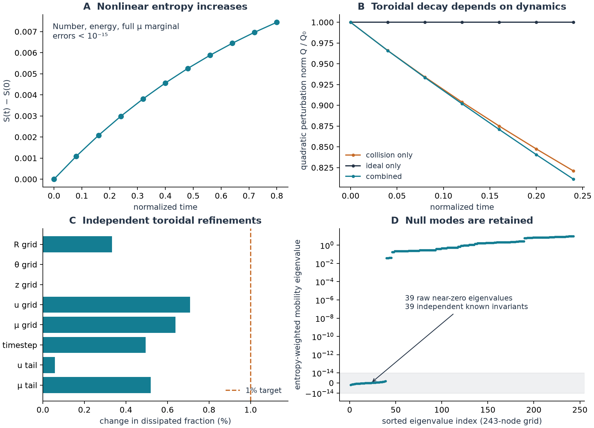
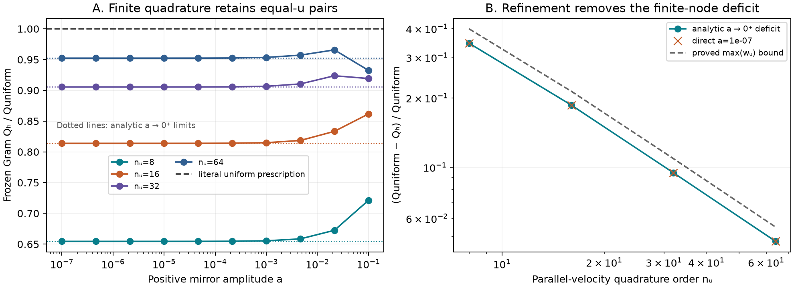
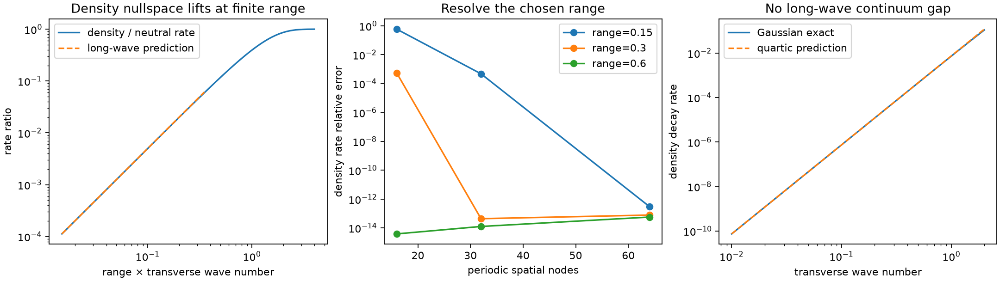
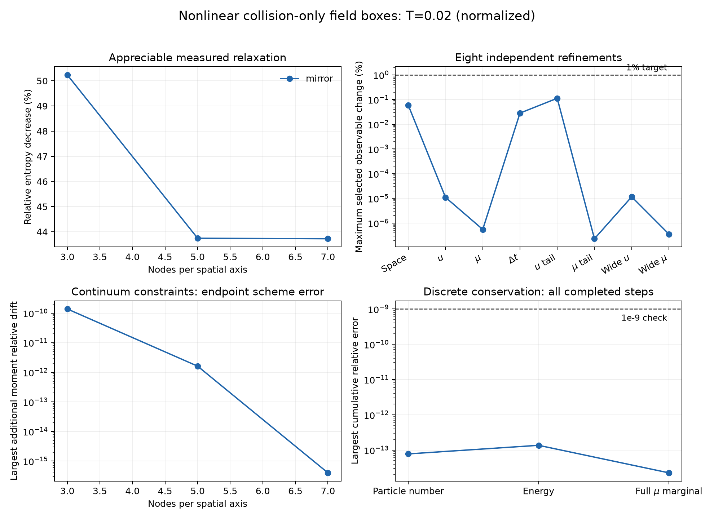
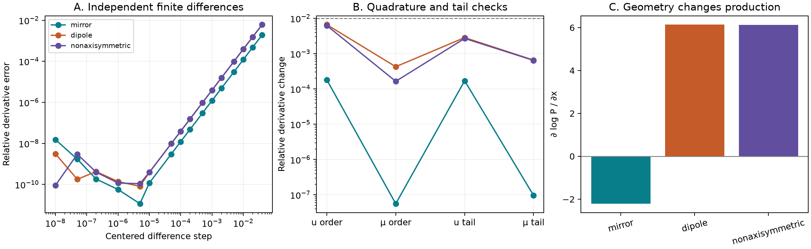
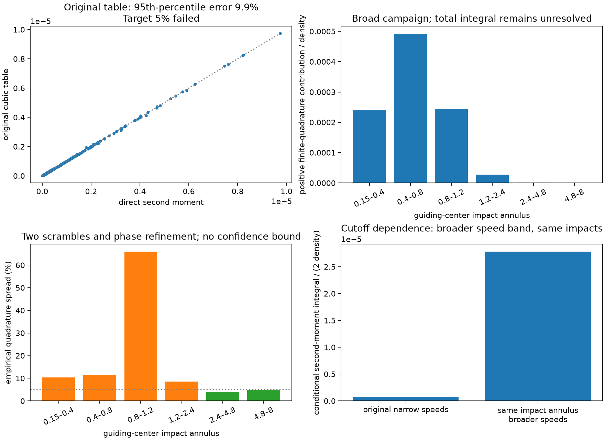
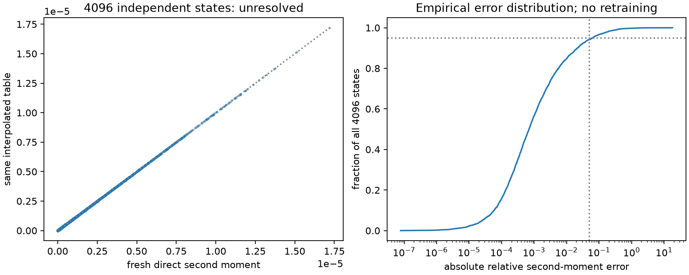
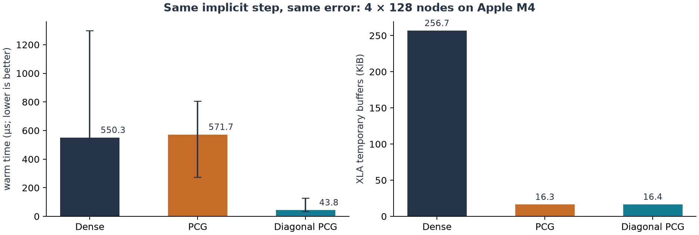

# Sato–Morrison collision prototypes

**What relaxes when collisions preserve the full magnetic-moment distribution?**

This small JAX research code reproduces the uniform-field limit of Sato–Morrison Eq. (181), tests nonlinear constrained surrogates, and checks their limits against independent collision and encounter calculations. Geometry leaves additional quantities frozen. Finite interaction range can remove some of those constraints.

[Derivations & literature](notes/implementation.pdf) · [Validation ledger](results/validation.csv) · [Recorded results](results/summary.csv) · [Reproduce](#reproduce)


**Same perturbation, different nullspaces.** Independently assembled linear operators evolve nine velocity nodes on a fixed color scale. Density structure survives local collisions; finite range damps it. Time uses the prescribed coefficient, without physical rate calibration. [Still image](results/visual_summary/range_poster.png) · [MP4](results/visual_summary/range_evolution.mp4) · [Script](examples/09_visual_summary.py) · [Inputs and checks](results/visual_summary/metadata.json)

## Start here

```sh
git clone --branch visual-evidence https://github.com/rogeriojorge/sato-morrison.git
cd sato-morrison
python3.12 -m venv .venv
source .venv/bin/activate
python -m pip install -e '.[dev]'
python -m pytest -q
MPLBACKEND=Agg python examples/00_uniform_reference.py
MPLBACKEND=Agg python examples/01_relaxation.py
```

Examples are editable top-level scripts with explicit inputs, progress, diagnostics and saved plots. They enable float64, announce compilation, and report failed solves explicitly. SOLVAX supplies general linear algebra; there is no dependency on other UW Plasma physics codes.

## What the calculations establish

**187 tests passed on Linux CI.** The test suite compares independent equations, discrete conservation budgets and resolved limits. Each claim below links to its measured evidence.



**A. Nonlinear relaxation.** Number, energy and full resolved moment-bin marginal errors stay below `1e-15`. Entropy increases; nodal and reconstructed positivity pass. Timestep order: `2.00`.

**B–C. Toroidal dynamics.** Combined streaming and collisions give `Q/Q₀ = 0.8109803`. Independent grid, tail and timestep refinements change the dissipated fraction by less than `0.71%`. Streaming alone preserves this norm.

**D. Null modes are retained.** Independently verified invariants account for all 39 near-zero eigenvalues of the raw 243-node matrix. Signed roundoff values are shown without clipping. This does not establish a continuum gap.

[Nonlinear data](results/relaxation.json) · [Toroidal data, refinements and eigenvalues](results/geometry.json) · [Figure script](examples/09_visual_summary.py)

## The model, and its exact uniform limit

For a prescribed vacuum field, the state and invariant measure are

```math
f=f(\mathbf X,u,\mu),\qquad
\mathrm d\Gamma=B\,\mathrm d^3X\,\mathrm du\,\mathrm d\mu,
\qquad E=\tfrac12mu^2+\mu B+q\Phi.
```

The implemented nonlinear weak surrogate is

```math
\begin{aligned}
\int\phi\,C[f]\,\mathrm d\Gamma
&=-\frac12\iint ff'\,\Delta\phi^{\mathsf T}\Pi\,\Delta\ln f\,
\mathrm d\Gamma\,\mathrm d\Gamma',\\
\Delta\phi&=J\nabla\phi-J'\nabla'\phi',\qquad \Pi=D\,P I_X P.
\end{aligned}
```

Pair vectors use the same Cartesian chart $(\mathbf X,u,\eta=\mu B)$. Local quadrature includes both velocity Jacobians. The energy projector uses the same discrete derivative as the weak form. Undefined nonuniform zero directions fail visibly.

This simplified kernel and its nonlinear extension are **not the full source Eq. (119)**. The implemented local scalar approximation to Eq. (181) has the independently checked uniform limit

```math
C_L[\delta f]=\frac{D}{(qB)^2}\nabla_\perp^2
\bigl(n_0\delta f-f_0\delta n\bigr),
\qquad \lambda=\frac{Dn_0 k_\perp^2}{(qB)^2}.
```

The 216-node pair calculation matches this oracle to relative error `2.36e-16`. Every homogeneous velocity perturbation and every local density-like mode is undamped. For a nonzero perpendicular Fourier mode, the remaining velocity-neutral modes decay at $\lambda$. [Oracle and timestep evidence](results/uniform_reference/summary.json)

<details>
<summary>A uniform oracle can miss a near-uniform quadrature bias</summary>



For the local frozen quadratic form with test function $h=\mu x$, node pairs with equal $u$ carry nonzero quadrature weight. Their projector limit differs from the literal uniform prescription. The resulting deficit falls from **34.6% at 8 nodes to 4.76% at 64 nodes**, in agreement with the derived positive-weight bound. Forty direct calculations independently check the analytic limit and common-chart actions.

This is a finite-quadrature limitation. The set with equal $u$ has zero continuum measure, and refinement restores the uniform limit. The plotted quantity is a frozen quadratic form, not equilibrium entropy production or a physical discontinuity. [Script](examples/18_near_uniform.py) · [Inputs and checks](results/near_uniform/summary.json) · [Derivation](notes/implementation.pdf)

</details>

## Geometry and interaction range select what can relax

### Finite range changes which density modes survive



For a normalized Gaussian spatial kernel of width $\ell$, independent ordered-pair assembly verifies

```math
\lambda_{\mathrm{neutral}}=\lambda,\qquad
\lambda_{\mathrm{density}}=\lambda\left(1-e^{-\ell^2|\mathbf k|^2/2}\right).
```

Finite range lifts the density null mode and gives quartic transverse long-wave decay; homogeneous modes remain undamped. The finest density-rate error across 27 comparisons is `3.03e-13`. The middle panel exposes large errors from unresolved narrow kernels.

This independently checked **surrogate result** has unresolved publication priority and no inferred physical rate. [All 27 comparisons](results/finite_range/summary.csv)

### Toroidal geometry obstructs unique relaxation

Local toroidal collisions preserve **every spatial population**. Streaming still preserves every radial population, obstructing a unique equilibrium determined by energy and the magnetic-moment marginal alone.

An independent smooth-nullspace audit gives

```math
\begin{aligned}
h_{\mathrm{collision}}&=\phi(R,\theta,z)+g(\theta,\mu)+a(\theta)E+b(\theta)mRu,\\
h_{\mathrm{joint}}&=\phi(R)+g(\mu)+aE+b\,mRu.
\end{aligned}
```

Here “joint” means collision-null and stationary under ideal streaming. The classification assumes $B=C/R>0$, constant potential, positive pair weight and an open product velocity support. Closed periodic/tangent boundaries are required for the stated evolution budgets. The [proof and scope](notes/implementation.pdf) are separate from the finite-grid rank check. No quantitative decay bound follows; publication priority remains unresolved.

### A dipole remembers more than its mean flux


Local collisions in an axisymmetric poloidal field preserve every meridional spatial population. For an axisymmetric electrostatic potential and closed, compatible ideal boundaries, **the entire poloidal-flux distribution remains conserved**. In a dipole,

```math
\begin{aligned}
\psi&=\frac{C R^2}{(R^2+z^2)^{3/2}},\\
\frac{\mathrm d}{\mathrm dt}\int F(\psi)f\,\mathrm d\Gamma&=0
\quad\text{for every admissible }F.
\end{aligned}
```

The plotted positive quadrature populations have the same number, energy, full resolved moment-bin marginal **and mean flux**, but different second flux moments. The initial flux distribution places a `1.5141e-5` lower bound on relative entropy per particle from the stationary candidate. Refining all four quadratures changes that bound by `1.2e-10` relatively.

This is a constructive **negative result for the local surrogate**: the usual energy-and-moment constraints do not determine an accessible final state. The finite-domain calculation is collision-only; it does not simulate confined dipole dynamics. Canonical momentum conservation is established physics; the stronger population constraint and its consequences are checked here without claiming publication priority.

For the specified nonaxisymmetric perturbation, independent exact-rational and automatic-differentiation checks prove that no nonconstant **C² spatial** ideal invariant common to all velocities survives. This does not classify all phase-space invariants or establish a spectral gap. The proof, parameter interval and domain are in the [notes](notes/implementation.pdf). [Construction and inputs](results/dipole_obstruction/summary.json) · [Script](examples/15_dipole_obstruction.py)

## Geometry and physical scope

| Field | Implemented evolution and measure | Boundary treatment |
|---|---|---|
| Uniform | Nonlinear collisions; $`B\,\mathrm d^3X\,\mathrm du\,\mathrm d\mu`$ | Periodic spatial direction; natural zero collision flux in velocity |
| Vacuum toroidal | Linear collisions + Hamiltonian streaming; $`RB\,\mathrm dR\,\mathrm d\theta\,\mathrm dz\,\mathrm du\,\mathrm d\mu`$ | Periodic angle/height; tangent radial walls; zero collision flux |
| Harmonic mirror, dipole, controlled nonaxisymmetric | Nonlinear collision-only Cartesian boxes; $`B\,\mathrm d^3X\,\mathrm du\,\mathrm d\mu`$ | Natural zero collision flux; no combined confined dynamics claim |

The known stationary density family and a full-marginal equilibrium multiplier are checked independently. A stationary candidate is not a proof of attraction. [Density comparisons](results/equilibria/density.png)

**New velocity-tail check:** 36 nonuniform initial-production cases. All three fields pass the Gauss-quadrature target; the largest final change is `0.261%`. Trapezoidal controls remain unresolved at `10–17%`. This does not establish full time-evolution or joint spatial/velocity convergence. [Convergence plot](results/field_velocity/production.png) · [All checks](results/field_velocity/summary.json)

### Finite-time mirror relaxation survives independent refinements



Thirteen discrete-gradient runs reach $T=0.02$: relative entropy decreases by **43.74%** on the baseline grid. All eight independent grid, tail and timestep checks pass the 1% target; the largest change is **0.113%**. Number, energy and the full resolved moment-bin marginal stay within `1.4e-13`; marginal bin errors are normalized by total particle number. Additional continuum constraints are measured as discretization errors.

This completed mirror campaign retains its original method and source. Dipole and nonaxisymmetric solves with that method failed visibly; their replacement entropy-variable campaign is separate. The comparisons do not establish joint continuum convergence or resolve every localized constraint. [Inputs, histories and provenance](results/nonuniform_mirror_dg/raw/summary.json) · [Independent audit and costs](results/nonuniform_mirror_dg/audit.json) · [Archived producing source](https://github.com/rogeriojorge/sato-morrison/blob/4ce8e5c770665a396d5083aec1e5f2b89a6a6ecf/examples/12_nonuniform_evolution.py)

<details>
<summary>Independent geometry-derivative checks</summary>



The local initial-production derivative includes the field, invariant measure, distribution and pair projector. An independent pair assembly agrees within `1.1e-15`; centered finite differences show a roundoff plateau. All final derivative quadrature/tail changes are below `0.67%`. This is a local observable check, not an implicit evolution gradient. [Script](examples/14_geometry_sensitivity.py) · [Inputs and refinements](results/geometry_sensitivity/summary.json)

</details>

### Encounters expose the limits of a constrained closure



The upper-left panel shows the earlier coarse table. The independent tail test below evaluates its refined replacement.

**Energy conservation does not imply magnetic-moment conservation.** Direct screened encounters resolve nonzero moment changes. The original narrow incoming-flux integral converges to `0.021%`, but covers only `11.6%` of the selected annulus's incoming thermal flux.

**Wider coverage changes the answer.** A 38,220-trajectory audit covers `88.9%` of that speed flux. In the same impact annulus, the broader speed band gives a second-moment contribution about **35 times larger**. Four inner impact bands remain under-resolved; no complete diffusion coefficient is reported. Positive bars are contributions to the chosen finite quadrature, not rigorous bounds on a continuous integral.

**Small average error can hide a failed tail criterion.** A refined periodic scattering table has `0.228%` normalized second-moment RMS error on 4,096 untouched states within its training hull, yet its 95th-percentile relative error is `6.26%` (95% order-statistic interval `5.32–7.22%`), above the predeclared `5%` target. The smaller 256-state sample had suggested a pass. Both records are retained; the table remains unresolved. A predeclared `8³×32` refinement keeps the original validation domain and targets, with a fresh 4,096-state test pending. [Current script](examples/16_scattering_table.py)

<details>
<summary>Why the scatter plot alone is insufficient</summary>



The archived `6³×32` table was tested without parameter retuning. Dashed lines mark the required 95% coverage at 5% relative error. [Producing script](https://github.com/rogeriojorge/sato-morrison/blob/cdb577b5620df82670c0d2485c19cb51a4cdf243/examples/16_scattering_table.py) · [Fresh sample and confidence interval](results/scattering_table/validation_4096/metadata.json)

</details>

The [extended-flight audit](results/encounter_duration/metadata.json) resolves one rare reflected encounter and checks it against an independent 12D pair trajectory. Its close approach lies outside verified grazing and adiabatic ordering; it does not refute the source’s asymptotic working regime.

[Original bounded integral](results/encounter_ensemble/metadata.json) · [Broader coverage](results/encounter_validation/metadata.json) · [Figure script](examples/17_encounter_duration.py) · [Independent tail test](results/scattering_table/validation_4096/metadata.json)

| Independent control | Verified capability | Limit |
|---|---|---|
| Lorentz | Exact speed-shell Legendre decay | Momentum exchanges with a reservoir |
| Dougherty | Conserving nonlinear Gaussian-mixture evolution; independent strong-equation check | Homogeneous mixture family |
| Physical 3V Landau | Coulomb weak moments checked by spherical, Cartesian and independent Laplace quadratures | Not a general Landau time integrator |
| Magnetized encounters | Direct trajectories, bounded Maxwellian flux and analytic thermal-center moments | Held-out table unresolved; no calibrated constrained coefficient or lifetime |

[Control evidence](results/controls/metadata.json) · [Trajectory controls](results/encounters/metadata.json). The prototype stage is implemented and tested. A physically validated constrained kinetic closure remains open.

## Measured cost



Four spatial blocks × 128 velocity nodes, Apple M4 CPU, five synchronized repetitions; all routes have the same time-discretization error `2.77e-5`. Bars show warm medians; whiskers show min–max. Compilation plus first execution is `0.092 / 0.184 / 0.225 s` for dense / PCG / diagonal-PCG.

For the separate 945-pair weak action, chunking by 16 reduces XLA temporary buffers from 118,913 to 16,480 bytes, while warm median time grows from 96.3 to 158.2 μs. These are small CPU measurements, not a general nonuniform speedup claim. Process peak RSS is recorded separately from temporary buffers. [Complete matched-error measurements](results/benchmarks/summary.json)

## Reproduce

Run from the repository root with the environment above. Every script prints its inputs and writes data and figures under `results/`. Example 13 writes fresh runs in `results/encounter_validation/reproduction/`, preserving the original campaign audited by example 17.

| Command (prefix with `MPLBACKEND=Agg python`) | Calculation |
|---|---|
| `examples/00_uniform_reference.py` | Eq. (181) oracle and backward-Euler convergence |
| `examples/01_relaxation.py` | Positive nonlinear solve, entropy and timestep refinement |
| `examples/02_geometry.py` | Toroidal controls, eight refinements and raw nullspace |
| `examples/03_controls.py` | Lorentz, Dougherty and physical 3V Landau references |
| `examples/04_encounters.py` | Direct encounters and phase/endpoint controls |
| `examples/05_benchmarks.py` | Matched-error runtime and memory |
| `examples/06_range.py` | Finite-range spectrum and kernel resolution |
| `examples/07_equilibria.py` | Five-field stationary density quadrature |
| `examples/08_fields.py` | Three nonlinear nonuniform collision boxes |
| `examples/09_visual_summary.py` | Operator animation and README panels; uses recorded results |
| `examples/10_encounter_ensemble.py` | Bounded incoming flux and held-out scattering table |
| `examples/11_field_velocity.py` | Nonuniform initial-production velocity/tail convergence |
| `examples/12_nonuniform_evolution.py` | Positive lagged-mobility evolution; 45 independent refinement cases |
| `examples/13_encounter_validation.py` | Wider incoming-flux coverage and independent table validation |
| `examples/14_geometry_sensitivity.py` | Local production derivative, independent pair form and finite-difference plateau |
| `examples/15_dipole_obstruction.py` | Matched constraints, different flux populations and a positive distance floor |
| `examples/16_scattering_table.py` | Predeclared 8-node table refinement; fresh tests pending |
| `examples/17_encounter_duration.py` | Original nonexit: flight budget, timestep, endpoint and independent pair audit |
| `examples/18_near_uniform.py` | Analytic and direct near-uniform tensor-quadrature limit |
| `examples/19_solver_accuracy.py` | Separate nonlinear/linear tolerance scans at fixed grid and timestep |

MP4 export additionally uses `ffmpeg`; GIF export works with the listed Python dependencies.

Each result records inputs, units, source commit/digest, versions and hardware. Older experiments retain their original provenance when new ones are added. The [validation ledger](results/validation.csv) distinguishes passing, unresolved and unrun requirements; [original](results/reproduction.json), [continuation](results/continuation.json) and [fresh-install reproduction](results/deep_reproduction.json) records contain executed commands and scientific comparisons. Detailed mathematics and literature belong in the [notes](notes/implementation.pdf), with [LaTeX source](notes/implementation.tex) and [bibliography](notes/references.bib).

<details>
<summary>Rebuild the notes</summary>

```sh
cd notes
pdflatex -interaction=nonstopmode -halt-on-error implementation.tex
bibtex implementation
pdflatex -interaction=nonstopmode -halt-on-error implementation.tex
pdflatex -interaction=nonstopmode -halt-on-error implementation.tex
```

</details>

## Remaining limits

The discrete-gradient solver has independently compared dense and matrix-free Newton routes. The nonuniform campaign uses a separate lagged-mobility entropy step: its positive root and conservation budget are proved, and independent tiny-grid checks establish first-order time accuracy. The historical mirror campaign passes eight thermal-domain time-evolution refinements. The new three-field campaign and joint spatial/velocity convergence remain under study. Local energy-flow injectivity is proved away from field-strength critical points; an explicit critical-point counterexample rules out a universal continuous projector prescription. Local initial-production geometry derivatives are verified, while general implicit geometry sensitivities remain incomplete. No self-consistent electrostatics, unequal-mass multispecies closure, current-carrying-field bracket, physical spectral gap, calibrated collision coefficient or metastable dipole lifetime is established. Encounter convergence alone does not establish a many-body kinetic closure.

## Attribution and license

Sato and Morrison, *Physics of Plasmas* **32**, 102306 (2025), [DOI](https://doi.org/10.1063/5.0289410); Brizard and Sugama, [arXiv:2506.22289v2](https://arxiv.org/abs/2506.22289v2); Kraus and Hirvijoki, [arXiv:1707.01801v2](https://arxiv.org/abs/1707.01801v2); Jose and Baalrud, [arXiv:2008.06080v1](https://arxiv.org/abs/2008.06080v1). Full comparisons are in the bibliography.

Original code, notes, figures and measured data are [MIT licensed](LICENSE). Third-party papers retain their own licenses and remain outside this repository. SOLVAX is an external dependency; no upstream modification was required.
