# Sato–Morrison collision prototype

Conserving magnetic moment restricts how a plasma can relax. This fixed-field JAX prototype follows [Sato & Morrison (2025)](https://doi.org/10.1063/5.0289410), reproduces their local linear Eq. (181), and studies explicit nonlinear and finite-range extensions. The calculations below separate conservation laws, numerical convergence and physical encounter dynamics.

## Magnetic coordinates

A charged particle spirals around a magnetic field. Averaging over that rapid orbit gives a guiding center. Its state consists of position **X**, signed parallel velocity **u**, and magnetic moment **μ**. The distribution **f(X,u,μ,t)** counts guiding centers in phase space.

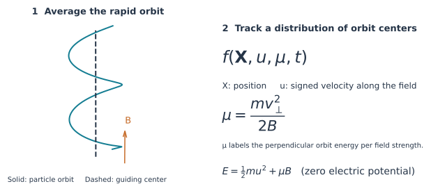

Here **m** is mass, **q** is charge and **B** is field strength. Magnetic moment measures perpendicular kinetic energy divided by B. Ideal motion approximately preserves μ when the gyroradius and gyroperiod are small compared with the field's spatial and temporal scales. The constrained collision operator preserves μ exactly.

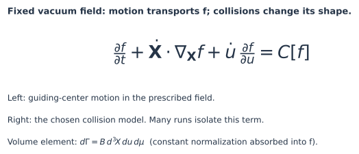

The transport terms move particles through the prescribed field; **C[f]** redistributes their population through collisions. For the vacuum fields used here, the volume element is **B d³X du dμ**. Most nonuniform runs isolate C[f]. The toroidal calculation also includes compatible ideal motion.

## Conservation constraints

The operator conserves number, total energy and the entire magnetic-moment distribution **G(μ)**. Each μ bin retains its population after integrating over position and parallel velocity.

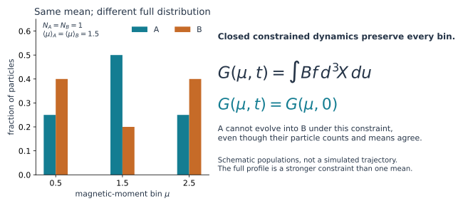

Both populations above have N = 1 and mean μ = 1.5. Their bin populations differ, so magnetic-moment-preserving collisions cannot connect them. Entropy can increase within the permitted states; the constraints and the operator's nullspace determine which states are accessible.

## Uniform field: exact solution

Write a small perturbation as a density modulation of the homogeneous reference **f₀**, plus a remainder **g** whose velocity integral vanishes. In the local linear model, the density modulation survives and the remainder diffuses across the field.

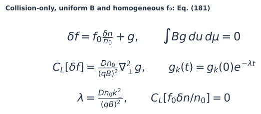

Here n₀ and δn are velocity integrals with measure B du dμ; k⊥ is the perpendicular wavenumber. The calculation assumes constant electric potential and collision-only evolution. **D is a prescribed coefficient**, so the time axis is normalized model time.

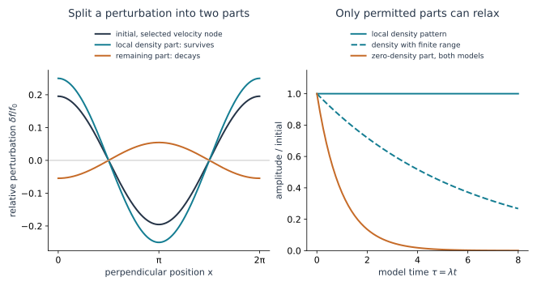

In the finite-range extension, a Gaussian interaction range **a** changes the density-branch rate to **λρ = λ[1 − exp(−a²k⊥²/2)]**. Since λ scales as k⊥², the long-wave density rate scales as k⊥⁴. The shape branch retains rate λ. The plotted range gives λρ/λ = 0.165.


Rows represent velocity-quadrature nodes. The animation uses saved operator evolution checked against the exact modes; maximum discrepancy is **3.08×10⁻¹⁵**. [Inputs and arrays](results/visual_summary/metadata.json)

## Discrete nonlinear model

The nonlinear kernel acts on differences of guiding-center derivatives. **Aᵢh** is the discrete action of J∇h, expressed in a common Cartesian η = μB chart. Here **J** is the guiding-center Poisson matrix. The energy direction ξ uses the same derivative as every test function. Projecting perpendicular to ξ enforces discrete energy conservation.

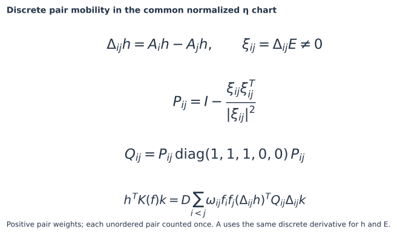

The positive weights ωᵢⱼ contain quadrature and, for nonlocal interactions, the spatial range kernel. The diagonal matrix selects the three spatial components before energy projection. Local pairs share one position. Each unordered pair enters once. The uniform zero-direction limit is derived analytically; an unresolved zero direction in a nonuniform field causes an error.

The full source Eq. (119) requires additional collision physics. The kernel above defines the project's nonlinear surrogate; Eq. (181) supplies the uniform linear reference.

## Implicit time integration

Let **nᵢ = wᵢfᵢ** be a node's population, with positive quadrature weight wᵢ. The matrix K is symmetric and positive semidefinite. Its null vectors include the constant, discrete energy and every μ-bin indicator χₐ.

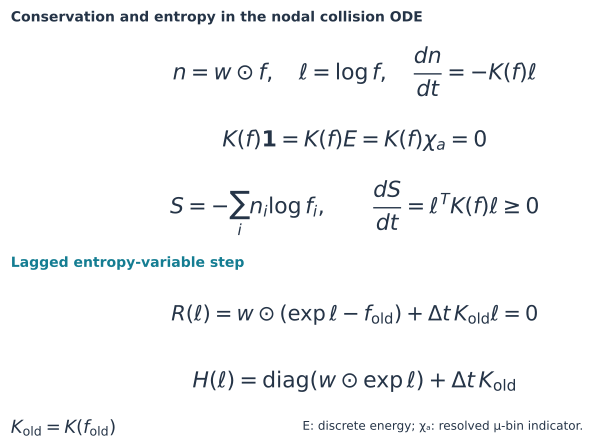

Small nonlinear reference problems use a second-order discrete-gradient step. The large nonuniform runs use the displayed first-order step, freezing K at the old density. Newton corrections use matrix-free Hessian products and SOLVAX PCG. Acceptance checks include the true linear residual, nonlinear residual, positive population and objective decrease. Failed steps raise an error and retain their last accepted state.

## Fields, boundaries and simulations

| Field | Domain and boundary treatment |
|---|---|
| Uniform | Periodic perpendicular coordinate; exact Fourier controls |
| Harmonic mirror | Cartesian box; natural zero collision flux |
| Vacuum toroidal | Cylindrical coordinates with the R Jacobian; periodic angle and tangent ideal motion |
| Dipole | Cartesian box excluding the field singularity; natural zero collision flux |
| Controlled nonaxisymmetric | Vacuum perturbation of the dipole; the same collision-only box treatment |

The three-field pilot starts from **f = exp[−E − 0.2μ + 0.1u sin(πy/0.4)]** on x ∈ [0.8,1.2], y ∈ [−0.2,0.2], z ∈ [0.1,0.5], u ∈ [−4,4], μ ∈ [0,20]. It uses **5³ × 25 × 13 = 40,625 nodes**, D = 0.1 and four steps of Δt = 0.005.

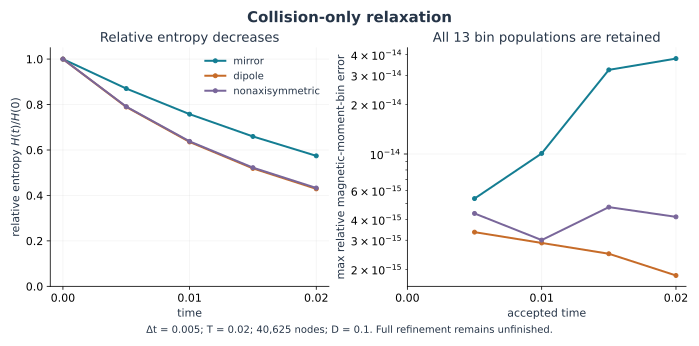

Here **H = Σᵢ wᵢ[fᵢ log(fᵢ/f⋆ᵢ) − fᵢ + f⋆ᵢ]**, with f⋆ proportional to exp(−E − 0.2μ) and normalized to the same particle number. It measures departure from this stationary reference, which need not be reachable. The curves use the accepted steps' entropy changes and the conserved moments. Independent pair calculations check the final residual and entropy identity. Two preconditioners agree within **1.50×10⁻¹²** in the weighted log-density norm. [Pilot comparison](results/nonuniform_spatial_blocks/preconditioner_comparison.json)

The mirror has a separate **15-run refinement study**: eight final observable changes are below 1%, with a maximum of **0.197%**. Coarse timesteps retain **2–3% bias**. Dipole and nonaxisymmetric grid/tail/timestep refinement is unfinished; the current campaign includes rejected steps in extreme tails. [Refinement ledger](results/nonuniform_spatial_blocks_full/summary.json)

## Geometry-dependent constraints

In the local dipole model, collisions preserve the population on each magnetic flux surface. Two distributions can therefore agree in number, energy, G(μ) and mean flux while retaining different flux distributions.


This construction gives a relative-entropy floor of **1.5141×10⁻⁵ per particle**. Joint quadrature refinement changes the bound by **1.1×10⁻¹⁰** relatively. The result applies to the specified local collision model and domain. A physical confinement lifetime still requires compatible ideal boundaries and calibrated collision physics.

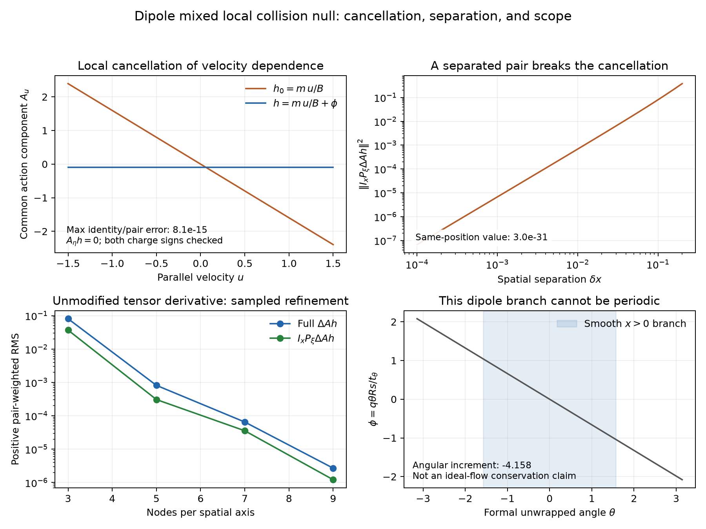

The mixed moment is conserved on an angular patch. Its angle dependence prevents a periodic extension; separated-pair interactions and ideal motion also change it.

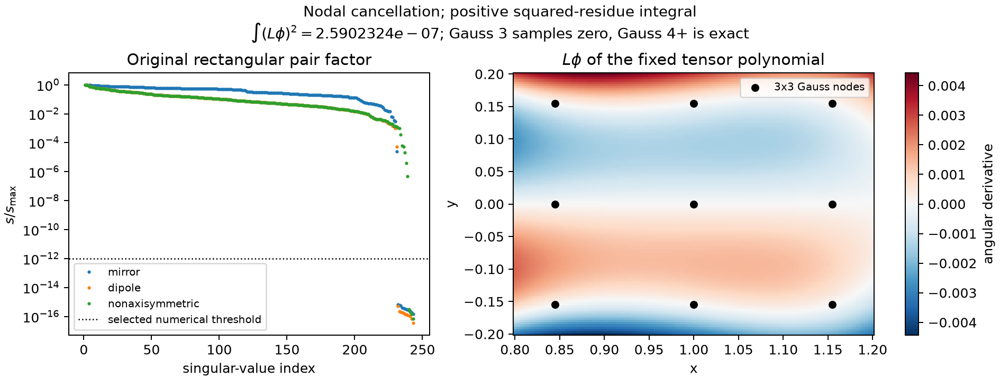

The finite-grid spectra retain every null mode. Three extra axisymmetric polynomial modes vanish at the sampled angular nodes; four-node quadrature detects their nonzero variation between nodes. They cannot be discarded to infer a continuum spectral gap.

## Direct particle encounters

Two repelling particles in a uniform field provide a physical check on magnetic-moment conservation. The incoming speeds and orbit-center separation are fixed while the phase around the spiral varies.

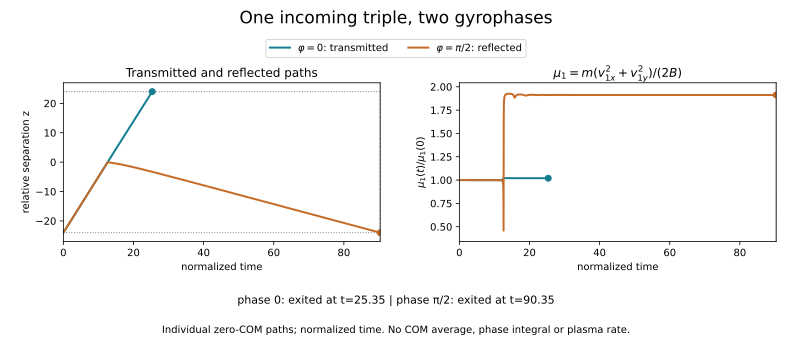

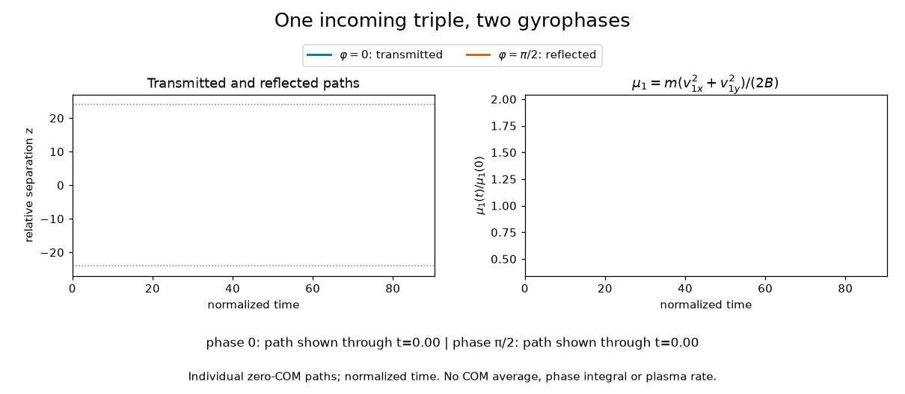

One path transmits at **t = 25.35**; the other reflects at **t = 90.35**. Their final magnetic moments are **1.020** and **1.912** times their initial values. Each curve stops at its outgoing event. These zero-center-of-mass paths lie outside a verified adiabatic/grazing regime. [Trajectory inputs and checks](results/encounter_movie/summary.json)

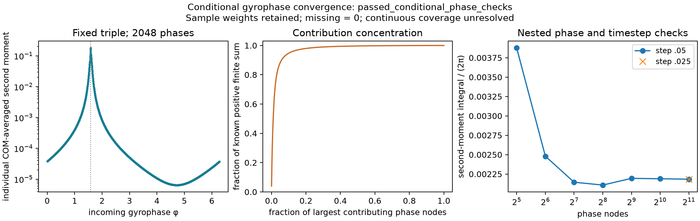

The squared μ change, averaged over center-of-mass motion and sampled incoming phases, passes its declared refinement criterion at **2,048 angles**: the last two changes are **0.243%** and **0.254%**. Halving the integration step changes this average by **4.10×10⁻¹¹**; twelve Cartesian trajectory controls pass. The mean change and cross moment converge more slowly: their last angular changes are **1.68%** and **4.80%**. Continuous angular coverage remains unresolved.

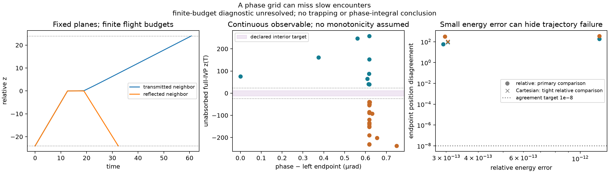

Near the boundary between transmission and reflection, refined trajectories disagree by tens to hundreds of length units despite energy errors near **10⁻¹²**. One predicted reflection becomes transmission. The exact flow's continuity implies slow intermediate trajectories between true opposite exits, but the finest computed bracket fails its trajectory checks. No trapping classification or collision rate follows from these data.

Lorentz and Dougherty operators supply separate relaxation controls. The physical 3V Landau reference evaluates Gaussian weak moments: independent spherical and Laplace calculations agree to **4.14×10⁻¹⁴**. Full Landau time evolution and plasma-rate calibration remain open.

## Runtime, memory and failure diagnostics

A preconditioner approximates the linear system used in each Newton correction. `xline` couples one spatial direction; `xyz` couples all three.

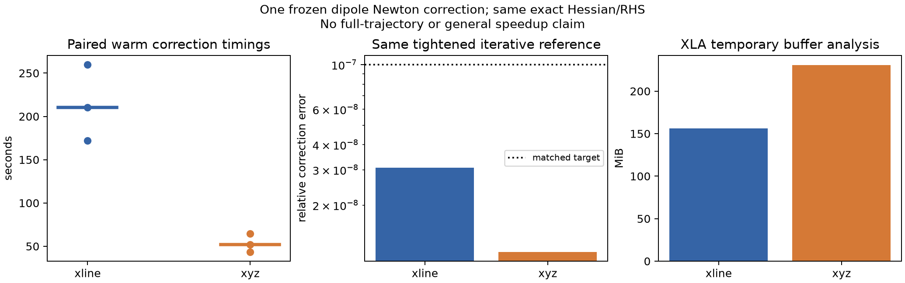

For the same frozen correction and **10⁻⁷** error target, three-repeat medians are **210.1 s** (`xline`) and **51.7 s** (`xyz`). Temporary buffers occupy **163.8 MB** and **241.8 MB**. These measurements used a shared M4 under varying load; complete-trajectory speedup has not been established. [All repeats, reference checks and memory accounting](results/difficult_correction/summary.json)

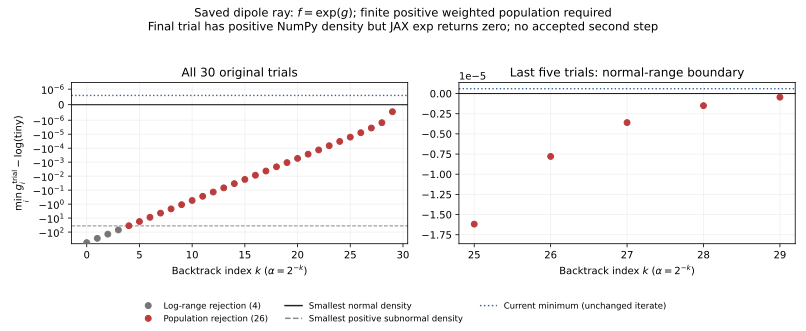

On this ray, exponentiation returns zero for trial tail populations and the positivity guard rejects them. A separate **300-second** continuation with 60 backtracks admits tiny updates but leaves the residual near **2.887**, against a **10⁻¹²** target. It accepts no second timestep. The recorded failures, rounded-update audit and partial states remain in the repository.

## Reproduce

```sh
git clone https://github.com/rogeriojorge/sato-morrison.git
cd sato-morrison
python3.12 -m venv .venv
source .venv/bin/activate
python -m pip install -e '.[dev]'
python -m pytest -q
MPLBACKEND=Agg python examples/00_uniform_reference.py
MPLBACKEND=Agg python examples/01_relaxation.py
MPLBACKEND=Agg python examples/22_first_principles.py
MPLBACKEND=Agg python examples/24_encounter_phase.py
MPLBACKEND=Agg python examples/27_encounter_movie.py
```

**247 tests pass locally and on fresh Linux CI.** Examples expose their inputs, print progress and fail visibly when a declared check fails. Saved results record inputs, units, producer commit, versions and hardware. Computation uses JAX and SOLVAX with independent NumPy/SciPy controls; no other UW Plasma physics package is required.

| Capability | Current evidence |
|---|---|
| Uniform Eq. (181) | Independent pair agreement **2.36×10⁻¹⁶**; exact limits and timestep convergence |
| Nonlinear constrained evolution | Number, energy, full μ marginal, entropy, positivity and solver-failure tests |
| Toroidal decay | Eight final refinement changes below **0.71%**; all **39** sampled collision nulls explained |
| Nonuniform evolution | Completed three-field pilots and mirror refinement; dipole/nonaxisymmetric refinements remain open |
| Physical controls | Lorentz, Dougherty, 3V Landau weak moments and independently checked binary trajectories |
| Physical rates and lifetimes | Uncalibrated; no metastable regime or dipole lifetime established |

The [example catalogue](examples/README.md), [validation ledger](results/validation.csv), [reproduction record](results/deep_reproduction.json) and [technical notes](notes/implementation.pdf) contain the complete commands and derivations. [LaTeX source](notes/implementation.tex) · [Bibliography](notes/references.bib). Original project material is [MIT](LICENSE); third-party papers are stored outside the public repository.
